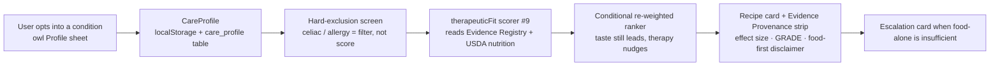
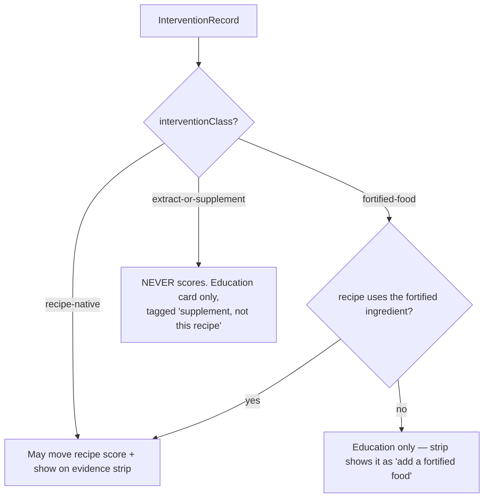

# Culinary Therapeutics — Technical Implementation Plan

> **Filed:** 2026-06-03 (Y5 cohort phase)
> **Author:** autonomous build agent
> **Coverage:** A 4-sprint workstream (CT-1 … CT-4, ~16 weeks) that slots into the Year-5 Vibecode plan, parallel to / after the Intelligence Layer (Sprints C–E) and consuming the USDA nutrition ingest (ADR 0001).
> **Source of evidence:** `Downloads/deep-research-report (2).md` — "Culinary Therapeutics Evidence Matrix for Therapeutic Recipe Optimization." This plan operationalizes that matrix; it does not invent clinical claims.
> **Thesis:** Add an **evidence-graded therapeutic-fit layer** to the deterministic pairing engine — a 9th scorer plus a hard-exclusion safety screen — so that a user who tells Sous "I have high LDL" / "IBS" / "celiac" / "MASLD" gets recipes from the _existing_ catalog nudged toward the highest-confidence food-first evidence, with honest provenance and never a medical claim. This deepens three moats at once (Engine, Data, Content) without adding a screen or a tab.

---

## ✅ BUILD STATUS — all four AUTO-BUILD sprints shipped (2026-06-03)

The full AUTO-BUILD foundation is in `main`, dormant behind the five founder gates. The live app is byte-identical (a golden non-regression test enforces it). One config flip — clinician sign-off (G1) flipping `reviewStatus`/`isEducational` — activates it.

- **CT-1 ✓ Evidence registry** — `src/types/therapeutics.ts`, `src/lib/therapeutics/claim-contract.ts` (`assertNoMedicalClaim` CI guard), `src/data/therapeutics/` (10 conditions · 23 interventions · 6 interaction rules, all `unreviewed`/`isEducational`), registry guard test, `pnpm therapeutics:gaps` (75% coverage + G2 work-list).
- **CT-2 ✓ Capture + safety** — `CareProfile` type + `use-care-profile` hook, the "Health focus" section in the owl Profile sheet (verified live), `therapeutic-exclusions.ts` (celiac → gluten-free; allergens), tested.
- **CT-3 ✓ Scorer + engine** — `therapeutic-fit.ts` (evidence-weight ladder, recipe-native/fortified only), `therapeutic-weights.ts` (0.18, sums to 1.0), `suggestSides` optional therapeutic context (exclusion screen + post-rank blend). Golden byte-identical invariant proven; activation gated on `registryIsClinicianApproved()` (false).
- **CT-4 ✓ Surfaces + hand-off** — `therapeutic-escalation.ts` (food-first + "leaky gut" education), `evidence-card.ts` + `EvidenceProvenanceStrip` (tested builder, dormant UI), `pnpm therapeutics:review` (the G1 clinician-review package).

**Remaining for G1 activation (one focused integration, intentionally not done pre-review):** thread the client `CareProfile` through the live `pairing.ts` tRPC call and render `EvidenceProvenanceStrip` on the result card when active. Kept undone so the live app stays unchanged until clinician + legal review clear.

---

## ⚠️ FOUNDER-GATED DEPENDENCIES (read first — rule 12)

Everything in this plan is **AUTO-BUILD** (ships behind an `isEducational` / `isPlaceholder` flag, exactly like the Content tab) **except** these five gates. They block _general-availability personalization_, not the build. AUTO-BUILD work ships first and dormant; each gate is a one-config flip when the founder provides the input:

| #   | Gate                                                            | Why it can't be autonomous                                                                                                                                             | What ships now (the dormant prep)                                                                                                                                                                                                                                                                    |
| --- | --------------------------------------------------------------- | ---------------------------------------------------------------------------------------------------------------------------------------------------------------------- | ---------------------------------------------------------------------------------------------------------------------------------------------------------------------------------------------------------------------------------------------------------------------------------------------------- |
| G1  | **Clinical sign-off of the evidence registry + claim copy**     | A registered dietitian / clinician must verify every encoded effect size, GRADE, and the structure-function claim language before it personalizes a real user's plate. | Full registry encoded from the research report **with `reviewStatus: "unreviewed"`**; all therapeutic copy gated behind `isEducational` and the existing `validateEditorialCompleteness()` queue. UI says "educational, not personalized medical advice" until `reviewStatus: "clinician-approved"`. |
| G2  | **Therapeutic recipes the current catalog lacks** (rule 7)      | New recipes must come from real reputable sources; the agent must not invent dishes.                                                                                   | The scorer + a **coverage-gap report** (`pnpm therapeutics:gaps`) that lists, per condition, how many catalog dishes qualify and which evidence lanes are unserved. Founder/editorial sources the gaps; integration is then a seed edit.                                                             |
| G3  | **Lab values / pregnancy / EHR signals** feeding escalation     | Real health data → consent, privacy, and a real data source the agent cannot stand up.                                                                                 | The escalation **thresholds + opt-in contract + schema fields** (`labSignals?`), dormant. Escalation runs on self-reported condition + severity only until a real source is wired.                                                                                                                   |
| G4  | **"Culinary Therapeutics" / Stanford / CIA branding** (rule 11) | Real institutional names/affiliations need written permission.                                                                                                         | Attribution + `permissionEvidence` slots present but carry `(sample)` framing; the curriculum scaffolding is cited generically ("culinary-medicine consensus") until permission lands.                                                                                                               |
| G5  | **Legal / regulatory review** of the claim posture              | FTC structure-function-claim and FDA disease-claim boundaries need human counsel.                                                                                      | The **claim-language contract** (`assertNoMedicalClaim`) + guard tests + disclaimer surfaces, reviewed before GA; until then the copy is conservative-by-construction and the feature is `isEducational`.                                                                                            |

**Sequencing rule honored:** CT-1 → CT-4 are AUTO-BUILD and run first. G1–G5 are surfaced here so they can be pursued in parallel by the founder rather than discovered mid-sprint.

---

## 0. One-screen summary



- **6 new subsystems:** Evidence Registry (data), Condition Profile (capture), Therapeutic-Fit Scorer (engine), Safety/Exclusion Engine (filter), Evidence Card UI, Escalation logic.
- **0 new screens, 0 new tabs.** Capture lives in the **owl Profile & Settings sheet** (the one rule-3-permitted settings surface). Output rides the _existing_ result/recipe cards.
- **Zero-input users are byte-identical.** The therapeutic weight is `0` unless a condition is active; the other 8 scorers keep their current weights, so non-therapeutic rankings never move.
- **Anti-overclaiming is the spine:** every evidence record is classed `recipe-native | fortified-food | extract-or-supplement`; only recipe-native (and fortified, when the recipe actually uses a fortified ingredient) can move a recipe's score. Extract/supplement evidence is shown as education, never as a recipe claim.

---

## 1. Strategic fit (STRATEGY.md alignment)

Per **CLAUDE.md rule 8**, a new feature must strengthen a compounding moat and pass the prioritization criteria. Culinary therapeutics is not a Section-11 "one new element" tweak — it is a **new pillar on the Engine moat**, justified the same way the 8 existing scorers are: _intelligence over inventory_.

| Moat (STRATEGY.md §2)                                                  | How culinary therapeutics deepens it                                                                                                                                                                                                      |
| ---------------------------------------------------------------------- | ----------------------------------------------------------------------------------------------------------------------------------------------------------------------------------------------------------------------------------------- |
| **Engine moat (§2.4)** — deterministic, explainable scorers            | Adds a 9th scorer that is _evidence-linked_ and explainable ("this supports a Portfolio-style LDL plan via β-glucan + nuts"). No competitor can replicate it without rebuilding both the domain model **and** a graded evidence registry. |
| **Data moat (§2.1)** — non-portable preference memory                  | The CareProfile (condition + severity + tolerated interventions, learned reintroduction results for low-FODMAP) is the _least_ portable data in the app. Leaving Sous means re-deriving your own therapeutic plan from zero.              |
| **Content moat (§2.2)** — hand-authored, hard to replicate             | Ties directly into the Stanford-attributed Content tab + clinician-credits queue already built. The evidence registry is curated editorial content, not scraped data.                                                                     |
| **Contrarian bet (§1.1)** — _less choice, intelligence over inventory_ | We do **not** add a "medical recipes" catalog. We re-rank the existing 203 sides / 93 mains through an evidence lens. Same inventory, sharper intelligence — exactly the thesis.                                                          |

**Hard constraints this plan respects:**

- **Rule 3 (no settings page):** capture is one calm section in the owl Profile & Settings sheet — the single permitted exception. No filter panels, no preference checklists.
- **Rule 6 / 13 (simplicity budget):** no new Today element by default. The evidence strip appears **only** on a recipe a condition-active user is already looking at, below the hero — conditional, never restating a signal shown elsewhere.
- **Risk §9.3 (AI dependency):** the entire therapeutic layer is **deterministic**. AI (the coach) may _warm the copy_, but the registry, scorer, exclusions, and escalation never depend on an LLM call. Mock-fallback parity, like every other surface.
- **"Food first, not food only":** baked into the escalation subsystem and the claim contract, straight from the research report's central caution.

**Anti-metric guard (STRATEGY.md §8.3):** success is still _cooks completed per condition-active user per week_ — **not** time-in-app, not "conditions configured." If adding a condition doesn't increase that user's cooking frequency, the feature has failed and we cut scope.

---

## 2. What already exists (build ON this — do not duplicate)

The probes found the substrate is ~70% present. This plan is mostly _wiring_, not greenfield.

| Capability                                  | Where it lives today                                                                                                                                                                                                                                                | Therapeutics reuse                                                                                                                                                           |
| ------------------------------------------- | ------------------------------------------------------------------------------------------------------------------------------------------------------------------------------------------------------------------------------------------------------------------- | ---------------------------------------------------------------------------------------------------------------------------------------------------------------------------- |
| 8-scorer pairing engine, weights sum to 1.0 | `src/lib/engine/scorers/*`, `ranker.ts`, `pairing-engine.ts`, `types.ts` (`DEFAULT_WEIGHTS`, `Scorer`, `ScoreBreakdown`)                                                                                                                                            | Add scorer #9 `therapeuticFit` exactly like `seasonal`/`antiMonotony` were added (optional key on `ScoreBreakdown`).                                                         |
| **Dietary hard-exclusion already wired**    | `src/lib/engine/dietary-inferer.ts` (`DIETARY_FLAGS` incl. **`gluten-free`** + full gluten term list; `satisfiesDietaryRequirement`), consumed in `pairing.ts` + `pod/agentic-picker.ts`                                                                            | **Celiac = strict `gluten-free` requirement, already functional.** We _harden_ it (certified / cross-contact class), not build it. Allergens reuse the same superset filter. |
| USDA-provenance nutrition model             | `src/types/nutrition.ts` (`PerServingNutrition`: 11 nutrients + calories/sodium_mg/addedSugar_g/saturatedFat_g + `provenance`/`confidence`), `src/data/nutrition/per-recipe.ts`, `claim-thresholds.ts` (`computeNutrientClaim`), ADR 0001                           | The therapeutic scorer reads `PerServingNutrition` for sodium (MASLD), fiber/β-glucan proxy (LDL/IBS), sat-fat (LDL). USDA ingest is a _prerequisite consumed_, not rebuilt. |
| Evidence / editorial / provenance           | `src/types/content.ts` (`ResearchBrief`, `BaseContentItem` w/ `isPlaceholder`, `sourceUrl`, `permissionEvidence`), `src/lib/editorial/{queue-resolver,clinician-credits}.ts` (`ClinicianCredit` w/ ORCID, `PublicationQueueEntry`, `validateEditorialCompleteness`) | The registry's provenance + the G1 clinical-review gate reuse this **as-is**. We add evidence-specific fields (effect size, GRADE, study type, formulation class).           |
| Capture surface                             | `src/components/shared/profile-settings-sheet.tsx` (owl sheet) + `src/lib/hooks/use-parent-mode.ts` + `src/lib/trpc/routers/prefs.ts` + `parent_profile` table (already has a `flaggedAllergens` jsonb stub)                                                        | The `CareProfile` mirrors `ParentProfile`'s persistence pattern 1:1; a new owl-sheet section sits after Parent Mode. The `flaggedAllergens` stub finally gets activated.     |
| Disclaimer + attribution UI                 | `src/components/shared/source-attribution.tsx`, `src/components/content/content-disclaimer.tsx`                                                                                                                                                                     | The Evidence Provenance strip extends `SourceAttribution`; the food-first disclaimer extends `ContentDisclaimer`.                                                            |
| Device identity                             | `src/lib/hooks/use-device-id.ts` (`x-sous-device-id` header, Clerk-upgradeable)                                                                                                                                                                                     | CareProfile is device-scoped like everything else; upgrades to the Clerk user in place.                                                                                      |

**Existing plans this EXTENDS (not duplicates):**

- **`NUTRITION_INTELLIGENCE_PLAN.md`** — nutrient _absorption_ pairings (iron + vitamin C, calcium interference). Those are deterministic interaction rules. Culinary therapeutics adds the **evidence grade + provenance** layer the nutrition plan deliberately omitted, and reuses its interaction rules as the registry's `INTERACTION` table.
- **`docs/INTELLIGENCE-LAYER-PLAN.md`** — `RecipeSource`/`RecipeProvenance` taxonomy + agentic recipe agent. Culinary therapeutics supplies the **clinical-claim provenance** that plan lacked, and the agentic recipe agent becomes the G2 sourcing tool for coverage gaps.
- **`docs/adr/0001-nutrition-data-source.md`** — USDA FoodData Central is _composition_ data, not intervention evidence. This plan adds the missing intervention layer **on top of** USDA, explicitly: "spinach is high in iron" (USDA fact) ≠ "eat spinach to fix anemia" (therapeutic claim, graded, food-first-caveated).

---

## 3. The six new subsystems

### 3.1 Evidence Registry `src/data/therapeutics/` + `src/types/therapeutics.ts`

A static, versioned, typed encoding of the research report's evidence matrix. Machine-readable so the scorer can consume it; human-readable so the evidence cards can cite it.

```ts
// src/types/therapeutics.ts
export type ConditionId =
  | "high-ldl"
  | "masld"
  | "ibs"
  | "ulcerative-colitis"
  | "crohns"
  | "celiac"
  | "iron-deficiency"
  | "vitamin-d-insufficiency"
  | "calcium-insufficiency"
  | "magnesium-insufficiency";
// NOTE: "leaky-gut" is intentionally ABSENT — the report shows it is not a
// formal diagnosis; it is modeled only as an education label (§3.6), never a condition.

export type Grade = "high" | "moderate" | "low" | "very-low";
export type StudyType =
  | "guideline"
  | "meta-analysis"
  | "rct"
  | "crossover-rct"
  | "observational"
  | "umbrella-review";

/** The anti-overclaiming spine. Only "recipe-native" (and "fortified-food"
 *  when the recipe uses the fortified ingredient) may move a recipe's score. */
export type InterventionClass =
  | "recipe-native"
  | "fortified-food"
  | "extract-or-supplement";

export type DirectionOfEffect =
  | "lowers"
  | "raises"
  | "improves-symptoms"
  | "no-benefit"
  | "exclude";

export interface EffectSize {
  metric: string; // "LDL-C MD", "IBS-SSS MD", "Hb"
  value: number; // -0.73
  unit: string; // "mmol/L"
  ciLow?: number;
  ciHigh?: number;
  heterogeneityI2?: number; // 68.6
  note?: string; // "~ -17%"
}

export interface InterventionRecord {
  id: string; // "ldl-portfolio-pattern"
  conditionId: ConditionId;
  label: string; // "Portfolio dietary pattern"
  direction: DirectionOfEffect;
  interventionClass: InterventionClass;
  grade: Grade;
  effect?: EffectSize;
  doseSignal?: string; // "≥3 g/day beta-glucan", "1.5–3 g/day sterols"
  recipeSignals: string[]; // catalog tags/ingredients that realize it: ["oats","barley","legumes","nuts"]
  prepImplication?: string;
  applicationNote: string; // clinician-honest phrasing
  // provenance — reuses the content/editorial model
  sources: { title: string; url?: string; studyType: StudyType }[];
  reviewStatus: "unreviewed" | "clinician-approved"; // G1 gate
  lastReviewedAt?: string;
  isEducational: boolean; // true until G1 + G5 clear
}

export interface InteractionRule {
  id: string; // "iron-vitc-enhance"
  target: NutrientKey | "ldl" | "ibs-symptoms" | "celiac-safety";
  enhancers: string[]; // ["vitamin C","heme","citrus"]
  inhibitors: string[]; // ["tea","coffee","calcium","phytate"]
  rule: string; // deterministic recipe-level optimization rule
  grade: Grade;
  sources: { title: string; url?: string; studyType: StudyType }[];
}
```

Data files (one per concern, tree-shakeable, drift-guarded):

- `conditions.ts` — `ConditionId` → display name, first-line strategy, best adjuncts, "what not to overstate" (from the report's §"Recommended condition-level priorities").
- `interventions.ts` — the full `InterventionRecord[]` (Portfolio −0.73 mmol/L recipe-native moderate; sterols fortified-food moderate; β-glucan recipe-native moderate; nuts recipe-native moderate; low-FODMAP −46 IBS-SSS recipe-native moderate **with phased reintroduction flag**; psyllium recipe-native moderate; peppermint-oil extract low; curcumin-UC **extract** low; celiac strict-GF **exclude/high**; MASLD-Mediterranean recipe-native moderate; omega-3 fortified/recipe-native; coffee observational low; iron-fortified-foods fortified moderate; vitamin-D-fortified fortified moderate; etc.).
- `interactions.ts` — the nutrient interaction map (iron + vitamin C, separate iron meals from tea/coffee/calcium; sterols + viscous fiber stack; oxalate vs calcium; low-FODMAP load rules). Reuses/absorbs `NUTRITION_INTELLIGENCE_PLAN`'s interaction set.
- `registry-version.ts` — `{ version, changelog }` + a **drift-guard test** (`therapeutics-registry.test.ts`) asserting every record has provenance, a non-empty `applicationNote`, a valid `interventionClass`, and passes `assertNoMedicalClaim`.

### 3.2 Condition Profile `CareProfile`

A sibling of `ParentProfile` (keeps Parent Mode's concern clean), same persistence pattern.

```ts
// src/types/care-profile.ts
export interface CareProfile {
  v: 1;
  conditions: ConditionId[]; // validated entities only — never "leaky gut"
  allergens: string[]; // activates the existing flaggedAllergens stub
  exclusions: DietaryFlag[]; // celiac auto-adds "gluten-free"
  // low-FODMAP is a PHASE, not a permanent diet (report §IBS):
  fodmapPhase?: "elimination" | "reintroduction" | "personalized" | null;
  fodmapReintroResults?: Record<string, "tolerated" | "trigger">; // learned, compounding
  severityNote?: string | null; // free text, never parsed into a diagnosis
  labSignals?: never; // G3 — schema slot reserved, dormant
  updatedAt: string;
}
```

- **Hook:** `src/lib/hooks/use-care-profile.ts` — localStorage key `sous-care-profile-v1`, setters `setConditions`, `setAllergens`, `advanceFodmapPhase`, `recordReintroResult`. Mirrors `use-parent-mode.ts`.
- **Server:** extend `prefs.ts` router with `setCareProfile`; new `care_profile` table (jsonb columns) mirroring `parent_profile`. Fire-and-forget persist via `vanilla.ts`, localStorage is source of truth (lean posture).
- **Capture UI:** new collapsible section in `profile-settings-sheet.tsx`, _after_ Parent Mode, _before_ Eco Mode. A calm multi-select chip list of the 10 conditions (with a one-line plain-English descriptor each), an allergen chip row, and — only when IBS is selected — a low-FODMAP phase stepper. Disclaimer line reuses `ContentDisclaimer` inline variant: _"Sous gives food-first ideas, not medical advice. Always work with your clinician."_ No labs, no numbers, no diagnosis flow.

This is the one place we _ask_ the user something — justified because a condition genuinely cannot be inferred from cooking behavior, and the report's whole thesis is evidence-**linked personalization**. Everything downstream stays zero-input.

### 3.3 Therapeutic-Fit Scorer (scorer #9)

```ts
// src/lib/engine/scorers/therapeutic-fit.ts
export const therapeuticFitScorer: Scorer = {
  name: "therapeuticFit",
  score(main, side, userPreferences?) {
    // pulls the active CareProfile via the same context channel preference uses;
    // if no conditions active → return 0.5 (neutral) AND weight is 0 (see below) → no effect.
    // else: for each active condition, look up recipe-native + applicable fortified
    //   InterventionRecords, match side.tags / side ingredients / PerServingNutrition
    //   against recipeSignals, weight each contribution by EvidenceWeight(grade) ×
    //   ConditionFit, subtract interaction & symptom-trigger penalties. Clamp 0–1.
    // NEVER reads extract-or-supplement records for scoring.
  },
};
```

Add `therapeuticFit?: number` to `ScoreBreakdown` (optional, like `seasonal`). Register in `ALL_SCORERS`. The report's `PriorityScore` formula maps directly:

```
contribution = EvidenceWeight(grade) × effectMagnitude × conditionFit × adherenceFit
             − interactionPenalty − symptomTriggerPenalty
EvidenceWeight: high 1.0 · moderate 0.75 · low 0.40 · very-low 0.20   (report default mapping)
```

**Conditional re-weighting** — the load-bearing design choice that keeps non-therapeutic users untouched:

```ts
// src/lib/engine/therapeutic-weights.ts
export function weightsForProfile(
  care?: CareProfile,
): Record<keyof ScoreBreakdown, number> {
  if (!care || care.conditions.length === 0) return DEFAULT_WEIGHTS; // byte-identical to today
  const wT = 0.18; // tunable; below cuisine/flavor so TASTE still leads
  const scale = 1 - wT; // 0.82
  return {
    cuisineFit: 0.22 * scale,
    flavorContrast: 0.22 * scale,
    nutritionBalance: 0.13 * scale,
    prepBurden: 0.13 * scale,
    temperature: 0.08 * scale,
    preference: 0.08 * scale,
    seasonal: 0.07 * scale,
    antiMonotony: 0.07 * scale,
    therapeuticFit: wT,
  }; // sums to 1.0
}
```

Why `0.18`: large enough to reorder sides toward the best evidence, deliberately **below** `cuisineFit`/`flavorContrast` so palatability and coherence still lead — because the report is emphatic that adherence (taste, cost, time) is what makes a therapeutic diet actually work. Tunable; starts here.

### 3.4 Safety & Exclusion Engine (hard filter, runs BEFORE scoring)

The report's flowchart is explicit: **hard exclusions first, then optimize within the feasible set.** This is a filter, not a scorer.

- Extend `dietary-inferer.ts` usage: a `CareProfile` with `celiac` injects a **required** `gluten-free` flag (already enforced) **plus** a `certified-gf` constraint class for the stricter cross-contact rules — recipes lacking a `certified-gf` / clean-prep attribute are filtered for celiac users, not merely down-ranked.
- Allergens map to the existing superset filter (`satisfiesDietaryRequirement`).
- A new `src/lib/engine/therapeutic-exclusions.ts` composes condition → required-flags (celiac→gluten-free+certified-gf; documented allergen→exclude), returning the feasible candidate set the ranker then scores. Pure, tested, no React.

### 3.5 Evidence Provenance Strip (UI)

`src/components/shared/evidence-provenance-strip.tsx`, rendered on the result/recipe card **only** for condition-active users, **below** the hero (rule 13). Extends `SourceAttribution`. Contents, per the report's "evidence provenance strip" spec:

- Condition targeted · **intervention class badge** (recipe-native / fortified / _educational only_) · pooled effect (when present) · **GRADE badge** · dose realism · "food-first, not food-only" line · source link.
- Example copy (claim-contract-compliant): _"Supports a Portfolio-style LDL plan via β-glucan and nuts. Strongest pooled effect needs daily repetition and is larger combined with sterol-fortified foods. Food-first — not a replacement for your clinician's plan."_
- Until G1: a small "Educational — not personalized to you yet" chip; the strip never asserts personalization.

### 3.6 Escalation logic ("food-first, not food-only")

`src/lib/engine/therapeutic-escalation.ts` — deterministic rules returning an optional calm card when food alone is insufficient: severe/symptomatic flags, the report's weight-loss thresholds for MASLD (>5 % steatosis, 7–10 % inflammation, >10 % fibrosis), celiac (always "strict exclusion + clinician"), and the micronutrient "food-first-not-food-only" caveats. **"Leaky gut" is handled here too** — as an _education_ card that redirects to validated entities (IBS, celiac, IBD, etc.), never as a scored condition. No diagnosis, no lab gating until G3.

---

## 4. Intervention-class taxonomy — the anti-overclaiming contract

The single most important rule from the research report, encoded as code, not prose:



`assertNoMedicalClaim(text)` (in `src/lib/therapeutics/claim-contract.ts`) is a pure validator run by a guard test over **every** registry string: bans `treats|cures|reverses|prevents <disease>|deficiency cure`; requires the food-first hedge on any condition-targeted claim; allows `supports|helps with|good source of|contributes to`. This is G5's reviewable artifact and a CI gate.

---

## 5. Condition coverage — ship order by confidence

Following the report's prioritization (build high-confidence engines first, adjuncts second):

| Tier                            | Conditions                                                                                                                                            | First-line recipe strategy                                              | Class                   | Sprint      |
| ------------------------------- | ----------------------------------------------------------------------------------------------------------------------------------------------------- | ----------------------------------------------------------------------- | ----------------------- | ----------- |
| **A — high-confidence engines** | High-LDL, IBS, MASLD (dietary quality), Celiac (safety)                                                                                               | Portfolio stack / phased low-FODMAP / Mediterranean+portion / strict-GF | recipe-native + exclude | CT-1 → CT-3 |
| **B — adjuncts**                | UC (curcumin = **education-only extract**), iron absorption, vitamin-D fortification, calcium/magnesium bioavailability                               | absorption rules + fortified-food nudges                                | fortified + education   | CT-3 → CT-4 |
| **C — explicitly bounded**      | Crohn's (nutrition sufficiency, **no omega-3 remission claim**), NCGS (don't default gluten-free), "leaky gut" (**education label, not a condition**) | conservative messaging                                                  | n/a                     | CT-4        |

---

## 6. Data & schema deltas (exact)

| Layer   | File                                                                                                    | Change                                                                                                                                                                                                                        |
| ------- | ------------------------------------------------------------------------------------------------------- | ----------------------------------------------------------------------------------------------------------------------------------------------------------------------------------------------------------------------------- |
| Types   | `src/types/therapeutics.ts` (new)                                                                       | `ConditionId`, `Grade`, `StudyType`, `InterventionClass`, `EffectSize`, `InterventionRecord`, `InteractionRule`                                                                                                               |
| Types   | `src/types/care-profile.ts` (new)                                                                       | `CareProfile`                                                                                                                                                                                                                 |
| Engine  | `src/lib/engine/types.ts`                                                                               | `therapeuticFit?: number` on `ScoreBreakdown`; **do not** edit `DEFAULT_WEIGHTS` (conditional weights live in `therapeutic-weights.ts`)                                                                                       |
| Engine  | `src/lib/engine/scorers/therapeutic-fit.ts` (new)                                                       | scorer #9                                                                                                                                                                                                                     |
| Engine  | `src/lib/engine/therapeutic-weights.ts`, `therapeutic-exclusions.ts`, `therapeutic-escalation.ts` (new) | weighting, hard filter, escalation                                                                                                                                                                                            |
| Data    | `src/data/therapeutics/{conditions,interventions,interactions,registry-version}.ts` (new)               | the registry                                                                                                                                                                                                                  |
| Catalog | `src/data/therapeutic-tags.ts` (new, **derived**)                                                       | per-dish therapeutic signals computed from existing `tags` + ingredients + `PerServingNutrition` (β-glucan proxy from oats/barley, legume/nut/fatty-fish presence, low sodium, sat-fat density). **No new recipes** — rule 7. |
| State   | `src/lib/hooks/use-care-profile.ts` (new)                                                               | localStorage + persist                                                                                                                                                                                                        |
| API     | `src/lib/trpc/routers/prefs.ts`                                                                         | `setCareProfile`; `care_profile` table in `schema.ts`                                                                                                                                                                         |
| UI      | `src/components/shared/profile-settings-sheet.tsx`                                                      | CareProfile capture section                                                                                                                                                                                                   |
| UI      | `src/components/shared/evidence-provenance-strip.tsx` (new), extend `content-disclaimer.tsx`            | output surfaces                                                                                                                                                                                                               |
| Tooling | `scripts/therapeutics-gap-report.ts` + `pnpm therapeutics:gaps`                                         | G2 coverage-gap report                                                                                                                                                                                                        |

---

## 7. AUTO-BUILD vs FOUNDER-GATED — every deliverable classified (rule 12)

| Deliverable                                                 | Class                  | Notes                                                                                                                                 |
| ----------------------------------------------------------- | ---------------------- | ------------------------------------------------------------------------------------------------------------------------------------- |
| Evidence Registry types + encoded matrix                    | **AUTO-BUILD**         | Effect sizes/GRADE/sources are _from the research report_ (real, citable). Ships `reviewStatus: "unreviewed"`, `isEducational: true`. |
| Therapeutic-fit scorer + conditional weights                | **AUTO-BUILD**         | Pure deterministic code + tests.                                                                                                      |
| Safety/exclusion (celiac, allergens)                        | **AUTO-BUILD**         | Extends an already-wired filter.                                                                                                      |
| CareProfile capture + persistence                           | **AUTO-BUILD**         | Mirrors ParentProfile; localStorage-first.                                                                                            |
| Evidence strip + escalation + disclaimer UI                 | **AUTO-BUILD**         | Renders behind `isEducational`.                                                                                                       |
| Derived therapeutic catalog tags                            | **AUTO-BUILD**         | Computed from existing data; **no invented recipes**.                                                                                 |
| Claim-language contract + guard tests + drift test          | **AUTO-BUILD**         | CI gates.                                                                                                                             |
| Coverage-gap report tool                                    | **AUTO-BUILD**         | Surfaces the G2 work-list.                                                                                                            |
| **Clinical sign-off → flip `reviewStatus`/`isEducational`** | **FOUNDER-GATED (G1)** | One config flip per record after RD review.                                                                                           |
| **New therapeutic recipes for gaps**                        | **FOUNDER-GATED (G2)** | Real sourcing (rule 7); integration = seed edit.                                                                                      |
| **Lab/pregnancy/EHR escalation inputs**                     | **FOUNDER-GATED (G3)** | Schema dormant; self-report only until wired.                                                                                         |
| **Stanford/CIA/"Culinary Therapeutics" branding**           | **FOUNDER-GATED (G4)** | `(sample)` until permission.                                                                                                          |
| **Legal/regulatory claim review → GA**                      | **FOUNDER-GATED (G5)** | Conservative-by-construction until reviewed.                                                                                          |

---

## 8. Phased plan (Year-5 house style)

Matches the `Appraise / Plan / Build / Loop 1–3 / Screenshot flow` per-week format. Slots into Y5 after the Intelligence Layer (Sprints C–E) — it depends on that preference/provenance substrate and the USDA nutrition ingest.

### Sprint CT-1 (W1–W4) — Evidence Registry foundation · _all AUTO-BUILD_

- **W1 — Schema + claim contract.** _Appraise:_ `ResearchBrief` has no effect size/GRADE; engine weights sum to 1.0. _Plan:_ `src/types/therapeutics.ts` + `claim-contract.ts`. _Build:_ types + `assertNoMedicalClaim` + unit tests. _Loop 1:_ fuzz claim strings ("cures IBS" must fail). _Loop 2:_ RCA any leak. _Loop 3:_ wire `assertNoMedicalClaim` into lint as a registry guard. _Screenshot:_ n/a (data layer) — test output instead.
- **W2 — Encode the matrix.** Encode all Tier-A + Tier-B `InterventionRecord`s from the report with provenance, `interventionClass`, `reviewStatus: "unreviewed"`, `isEducational: true`. _Loop 3:_ `registry-version.ts` + drift-guard test.
- **W3 — Interaction rules.** Port `NUTRITION_INTELLIGENCE_PLAN` interaction set into `interactions.ts` with grades + sources.
- **W4 — Sprint close.** Coverage-gap report tool (`pnpm therapeutics:gaps`) → emits the G2 work-list. Lint + tests + build green; commit.

### Sprint CT-2 (W5–W8) — Condition capture + safety screen · _AUTO-BUILD_

- **W5 — CareProfile type + hook.** localStorage `sous-care-profile-v1`, setters, versioned-storage tests (mirror `use-parent-mode.test`).
- **W6 — Owl-sheet capture section.** Calm multi-select; IBS reveals the low-FODMAP phase stepper; inline food-first disclaimer. No-scroll, 375px, reduced-motion gated. _Screenshot:_ owl sheet with two conditions selected.
- **W7 — Hard-exclusion engine.** `therapeutic-exclusions.ts`; celiac → `gluten-free` + `certified-gf`; allergens → superset filter; wire into `pairing.ts` candidate build. _Loop 1:_ celiac user never sees a gluten dish across the catalog (assertion test over all sides).
- **W8 — Server + close.** `prefs.setCareProfile` + `care_profile` table; fire-and-forget persist. Commit.

### Sprint CT-3 (W9–W12) — Therapeutic-fit scorer + catalog tagging · _AUTO-BUILD (+ G2 hand-off)_

- **W9 — Derived therapeutic tags.** `src/data/therapeutic-tags.ts` computed from existing tags/ingredients/USDA nutrition (β-glucan proxy, legume/nut/fatty-fish, sodium, sat-fat). Drift-guarded like `guided-cook-summary`.
- **W10 — Scorer #9.** `therapeutic-fit.ts` + `therapeutic-weights.ts` (`weightsForProfile`); register in `ALL_SCORERS`; `therapeuticFit?` on `ScoreBreakdown`. _Loop 1:_ **golden test — zero-condition users get byte-identical rankings** (the non-regression invariant).
- **W11 — Wire + tune.** Thread `CareProfile` through the pairing call; LDL + IBS + MASLD end-to-end. _Loop 2:_ verify taste still leads (a high-evidence but low-flavor side never tops a great-tasting adequate one).
- **W12 — Close.** Run `pnpm therapeutics:gaps`; file the G2 sourcing brief. Commit.

### Sprint CT-4 (W13–W16) — Evidence surfaces + escalation + clinical hand-off · _AUTO-BUILD UI; G1/G5 gates_

- **W13 — Evidence Provenance strip.** Component + result-card wiring (condition-active, below hero). _Screenshot:_ LDL plan card with GRADE + class badges.
- **W14 — Escalation + "leaky gut" education.** `therapeutic-escalation.ts`; MASLD thresholds; celiac always-clinician; leaky-gut redirect card.
- **W15 — Clinical-review package (G1).** Generate the RD-facing review export (every record + claim + source) through the existing `validateEditorialCompleteness()` queue; nothing flips to `clinician-approved` autonomously.
- **W16 — Workstream close.** Full lint + tests + build; e2e smoke (condition opt-in → exclusion → strip → escalation); update STRATEGY.md decision log + ROADMAP + Y5 plan pointer. Commit.

---

## 9. Safety & compliance contract

1. **Deterministic core.** Registry, scorer, exclusions, escalation never call an LLM. The coach may warm copy with mock-fallback parity (Risk §9.3).
2. **Claim language** is bounded by `assertNoMedicalClaim` + CI guard (supports/helps/good source of; never treats/cures/reverses). G5-reviewable.
3. **`isEducational` until G1+G5.** Until clinician + legal review, the feature presents as education and personalization is visibly hedged.
4. **Food-first, not food-only** is structurally enforced by the escalation subsystem and the strip's mandatory hedge line.
5. **No invented recipes/images** (rule 7): therapeutic tags are _derived_; new recipes are G2.
6. **No "leaky gut" ontology** — education label only, per the report.
7. **Privacy:** CareProfile is device-scoped, never placed in URLs/query strings; labs dormant until G3 consent contract.

---

## 10. Test & guard strategy

- `claim-contract.test.ts` — bans medical-claim verbs; requires food-first hedge. CI gate.
- `therapeutics-registry.test.ts` — every record: provenance present, valid class, passes claim contract, education flag set.
- `therapeutic-tags.test.ts` — drift guard (derived tags match regenerated output, like `guided-cook-summary`).
- `therapeutic-weights.test.ts` — `weightsForProfile()` sums to 1.0 in both states; **zero-condition = `DEFAULT_WEIGHTS` exactly** (non-regression invariant).
- `therapeutic-exclusions.test.ts` — celiac never yields a gluten dish across the full catalog; allergen superset holds.
- `simplicity-budget` extension — assert no new _default_ Today element; the strip is condition-gated and below the hero.
- e2e — opt into a condition → exclusion applies → strip renders → escalation fires for a severe flag.

---

## 11. Risks & mitigations

| Risk                                                         | Mitigation                                                                                                         |
| ------------------------------------------------------------ | ------------------------------------------------------------------------------------------------------------------ |
| Over-claiming / regulatory exposure                          | Intervention-class taxonomy + claim contract + `isEducational` + G1/G5 gates.                                      |
| Therapy degrades taste → adherence drops (defeats the point) | Therapeutic weight (0.18) sits below taste scorers; golden non-regression test; report-aligned adherence priority. |
| Catalog can't realize an evidence lane                       | `therapeutics:gaps` surfaces it; G2 sources real recipes; never invent (rule 7).                                   |
| Feature bloats the simple UI                                 | 0 new screens/tabs; capture in owl sheet; output conditional + below hero; simplicity-budget test.                 |
| "Leaky gut" / NCGS over-restriction                          | Modeled as education + conservative messaging, not conditions.                                                     |
| Scope creep into a medical device                            | North-star stays _cooks/week_; labs/EHR fenced behind G3; "food-first, not food-only" structural.                  |

---

## 12. STRATEGY.md decision-log entry (to append)

> **Jun 2026 — Culinary Therapeutics = a 9th, evidence-graded scorer, not a medical product.** Operationalize the culinary-therapeutics evidence matrix as a deterministic therapeutic-fit scorer + hard-exclusion safety screen over the _existing_ catalog (intelligence-over-inventory, §1.1). Capture lives only in the owl Profile sheet (rule 3); output rides existing cards (rule 13); zero-condition users are byte-identical. Anti-overclaiming is enforced in code (recipe-native vs fortified vs extract). Ships `isEducational` behind five founder gates (clinical sign-off, real recipe sourcing, lab/EHR, branding permission, legal review). Strengthens Engine + Data + Content moats simultaneously. Full plan: `docs/CULINARY-THERAPEUTICS-PLAN.md`.

## 13. Living-evidence maintenance loop

Per the report, this is a _living_ system. `registry-version.ts` carries a changelog; a quarterly (or guideline-triggered) re-appraisal updates effect sizes, re-checks `interventionClass` (has an extract effect become recipe-native?), and re-runs the gap report. New guideline / new meta-analysis crossing a clinical threshold / new safety signal → version bump + clinician re-review (G1) before any user-facing change.

---

_— End of Culinary Therapeutics Technical Implementation Plan —_
