# Sous — V1 architecture & build plan

> **Stage 1:** Internal side-dish pairer and basic guided cook — React web app (Next.js). This document is the **target** architecture for that build; it does not yet match every file in the repo.

**Related docs:** The **shipped NOURISH Meal Pairer prototype** (current app, data layout, and progress log) lives in **`documentation.md`**. Pairing pipeline, Python engine export, and regenerating `pairings.json`: **`PIPELINE.md`**. Product story, philosophy, and command cheatsheet: **`claude.md`**.

### Diagrams and UI specification (advanced)

| Section | Contents |
|---------|----------|
| **§19** | UML-style domain model, system components, deployment view (Mermaid) |
| **§20** | User journeys as flowcharts + sequence diagrams for core flows (Mermaid) |
| **§21** | Guided Cook state machine; progressive tab bar unlock |
| **§22** | ASCII wireframes: global shell, Today (all stages), modals, Guided Cook, Path, Community |

Mermaid renders in GitHub, many IDEs, and docs viewers. If a diagram fails to render, paste the fenced block into [mermaid.live](https://mermaid.live).

---

## 1. High-level architecture

```
┌─────────────────────────────────────────────────────────┐
│                      Client (React 19)                  │
│  ┌──────────┐  ┌──────────┐  ┌──────────┐              │
│  │  Today    │  │  Guided  │  │  Path    │  (hidden     │
│  │  Page     │  │  Cook    │  │  (stub)  │   until      │
│  │          │  │  Flow    │  │          │   earned)    │
│  └──────────┘  └──────────┘  └──────────┘              │
│         │              │             │                   │
│         ▼              ▼             ▼                   │
│  ┌────────────────────────────────────────┐             │
│  │       tRPC Client (TanStack Query)     │             │
│  └────────────────────────────────────────┘             │
└─────────────────────────┬───────────────────────────────┘
                          │ HTTPS
┌─────────────────────────▼───────────────────────────────┐
│                   Next.js API Layer                      │
│  ┌──────────────────────────────────────────────┐       │
│  │              tRPC Router                      │       │
│  │  ├─ pairing.suggest    (core engine)         │       │
│  │  ├─ pairing.explain    (why-this-won)        │       │
│  │  ├─ recognition.identify (photo → dish)      │       │
│  │  ├─ cook.start / .step / .complete           │       │
│  │  ├─ journey.log / .list                      │       │
│  │  ├─ coach.quiz / .vibePrompt                 │       │
│  │  └─ content.getSideDish / .search            │       │
│  └──────────────────────────────────────────────┘       │
│         │              │              │                   │
│         ▼              ▼              ▼                   │
│  ┌───────────┐  ┌───────────┐  ┌───────────┐           │
│  │  Pairing  │  │  AI Layer │  │  Drizzle  │           │
│  │  Engine   │  │  (Vision  │  │  ORM      │           │
│  │           │  │  + Claude)│  │           │           │
│  └───────────┘  └───────────┘  └───────────┘           │
│                                       │                  │
└───────────────────────────────────────┼──────────────────┘
                                        │
                              ┌─────────▼─────────┐
                              │    PostgreSQL      │
                              │    (Neon)          │
                              └───────────────────┘
```

---

## 2. Tech stack decisions

| Layer | Choice | Rationale |
|-------|--------|-----------|
| Framework | **Next.js 16 (App Router)** | Server Components for fast initial load, API routes co-located, Vercel deploy; aligns with the existing prototype in this repo |
| Language | **TypeScript (strict)** | Type safety across client, server, and DB schema |
| UI | **Tailwind CSS 4 + shadcn/ui** | Rapid, consistent UI. shadcn gives us headless components we own |
| Animation | **Framer Motion** | Smooth quest card transitions, step-by-step cook flow animations |
| Client state | **Zustand** | Minimal boilerplate for UI state (current step, camera mode, quiz answers) |
| Server state | **TanStack Query via tRPC** | Type-safe data fetching with cache, optimistic updates, retry |
| API | **tRPC v11** | End-to-end type safety between client and server, no codegen |
| ORM | **Drizzle** | Type-safe SQL, lightweight, excellent Neon/Postgres support |
| Database | **Neon (PostgreSQL)** | Serverless Postgres, scales to zero, branching for dev |
| AI: food recognition | **OpenAI Vision API (gpt-4o)** | Best accuracy for food identification from photos |
| AI: craving parsing | **Anthropic Claude (claude-sonnet)** | Structured output for parsing intent from freeform text |
| AI: coach | **Anthropic Claude** | Bounded persona responses for quiz results and win screens |
| Image storage | **Cloudflare R2** | S3-compatible, no egress fees, cheap at scale |
| Auth | **Clerk** | Drop-in auth with social login, session management |
| Cache | **Upstash Redis** | Rate limiting, AI response caching, session data |
| Testing | **Vitest + Playwright + RTL** | Fast unit tests, real browser E2E, component testing |
| Deploy | **Vercel** | Native Next.js support, edge functions, preview deploys |
| Package manager | **pnpm** | Fast, disk-efficient, strict dependency resolution |

---

## 3. Database schema (Drizzle)

### Core tables

```typescript
// src/lib/db/schema.ts

// ── Side dishes (V1 internal content) ──────────────────
export const sideDishes = pgTable('side_dishes', {
  id: uuid('id').primaryKey().defaultRandom(),
  name: text('name').notNull(),
  slug: text('slug').notNull().unique(),
  description: text('description').notNull(),
  cuisineFamily: text('cuisine_family').notNull(),   // mediterranean, south-asian, etc.
  prepTimeMinutes: integer('prep_time_minutes').notNull(),
  cookTimeMinutes: integer('cook_time_minutes').notNull(),
  skillLevel: text('skill_level').notNull(),          // beginner, intermediate, advanced
  flavorProfile: jsonb('flavor_profile').$type<string[]>().notNull(), // bright, rich, crunchy, etc.
  temperature: text('temperature').notNull(),          // hot, cold, room-temp
  proteinGrams: real('protein_grams'),
  fiberGrams: real('fiber_grams'),
  caloriesPerServing: integer('calories_per_serving'),
  heroImageUrl: text('hero_image_url'),
  bestPairedWith: jsonb('best_paired_with').$type<string[]>().notNull(), // main dish categories
  tags: jsonb('tags').$type<string[]>().default([]),
  isPublished: boolean('is_published').default(true),
  createdAt: timestamp('created_at').defaultNow(),
  updatedAt: timestamp('updated_at').defaultNow(),
});

// ── Guided Cook steps ──────────────────────────────────
export const cookSteps = pgTable('cook_steps', {
  id: uuid('id').primaryKey().defaultRandom(),
  sideDishId: uuid('side_dish_id').references(() => sideDishes.id).notNull(),
  phase: text('phase').notNull(),                     // mission, grab, cook, win
  stepNumber: integer('step_number').notNull(),
  instruction: text('instruction').notNull(),
  timerSeconds: integer('timer_seconds'),              // null if no timer
  mistakeWarning: text('mistake_warning'),             // null if none
  quickHack: text('quick_hack'),                       // null if none
  cuisineFact: text('cuisine_fact'),                   // null if none
  donenessCue: text('doneness_cue'),                   // null if none
  imageUrl: text('image_url'),                         // optional step image
});

// ── Ingredients ────────────────────────────────────────
export const ingredients = pgTable('ingredients', {
  id: uuid('id').primaryKey().defaultRandom(),
  sideDishId: uuid('side_dish_id').references(() => sideDishes.id).notNull(),
  name: text('name').notNull(),
  quantity: text('quantity').notNull(),                // "2 cups", "1 tbsp"
  isOptional: boolean('is_optional').default(false),
  substitution: text('substitution'),                  // "use lime if no lemon"
});

// ── Users ──────────────────────────────────────────────
export const users = pgTable('users', {
  id: text('id').primaryKey(),                         // Clerk user ID
  displayName: text('display_name'),
  avatarUrl: text('avatar_url'),
  preferenceVector: jsonb('preference_vector').$type<Record<string, number>>().default({}),
  completedCooks: integer('completed_cooks').default(0),
  currentStreak: integer('current_streak').default(0),
  longestStreak: integer('longest_streak').default(0),
  pathUnlocked: boolean('path_unlocked').default(false),
  communityUnlocked: boolean('community_unlocked').default(false),
  coachTone: text('coach_tone').default('gentle'),    // gentle, hype, no-nonsense
  createdAt: timestamp('created_at').defaultNow(),
});

// ── Cook sessions (journey log) ────────────────────────
export const cookSessions = pgTable('cook_sessions', {
  id: uuid('id').primaryKey().defaultRandom(),
  userId: text('user_id').references(() => users.id).notNull(),
  sideDishId: uuid('side_dish_id').references(() => sideDishes.id).notNull(),
  mainDishInput: text('main_dish_input'),              // what user typed or photo result
  inputMode: text('input_mode').notNull(),             // text, photo
  status: text('status').notNull(),                    // started, completed, abandoned
  completionPhotoUrl: text('completion_photo_url'),
  personalNote: text('personal_note'),
  rating: integer('rating'),                           // 1-5 optional
  startedAt: timestamp('started_at').defaultNow(),
  completedAt: timestamp('completed_at'),
});

// ── Saved recipes ──────────────────────────────────────
export const savedRecipes = pgTable('saved_recipes', {
  id: uuid('id').primaryKey().defaultRandom(),
  userId: text('user_id').references(() => users.id).notNull(),
  sideDishId: uuid('side_dish_id').references(() => sideDishes.id).notNull(),
  savedAt: timestamp('saved_at').defaultNow(),
});

// ── Coach quiz responses ───────────────────────────────
export const quizResponses = pgTable('quiz_responses', {
  id: uuid('id').primaryKey().defaultRandom(),
  userId: text('user_id').references(() => users.id).notNull(),
  questionKey: text('question_key').notNull(),         // crunchy-vs-saucy, bright-vs-cozy, etc.
  answer: text('answer').notNull(),
  answeredAt: timestamp('answered_at').defaultNow(),
});
```

### Indexes

```typescript
// Performance indexes
export const sideDishCuisineIdx = index('idx_side_dish_cuisine').on(sideDishes.cuisineFamily);
export const cookSessionUserIdx = index('idx_cook_session_user').on(cookSessions.userId);
export const cookSessionStatusIdx = index('idx_cook_session_status').on(cookSessions.status);
export const savedRecipeUserIdx = index('idx_saved_recipe_user').on(savedRecipes.userId);
```

---

## 4. Pairing engine architecture

```
src/lib/engine/
  ├── pairing-engine.ts       # Main orchestrator
  ├── scorers/
  │   ├── cuisine-fit.ts      # How well does the side match the main's cuisine?
  │   ├── flavor-contrast.ts  # Does it provide balance (bright vs. rich)?
  │   ├── nutrition-balance.ts # Does it complement the main nutritionally?
  │   ├── prep-burden.ts      # Is the total prep manageable?
  │   ├── temperature.ts      # Hot main + cold side = good contrast?
  │   └── preference.ts       # User's implicit taste vector
  ├── ranker.ts               # Weighted score aggregation, top-3 selection
  ├── explainer.ts            # Generates plain-language "why this won" text
  └── types.ts                # Scoring types and interfaces
```

### Scoring algorithm

```typescript
// Simplified scoring flow
type ScoredCandidate = {
  sideDish: SideDish;
  scores: {
    cuisineFit: number;       // 0-1 — from cuisine compatibility matrix
    flavorContrast: number;   // 0-1 — penalize same-profile, reward complement
    nutritionBalance: number; // 0-1 — fiber, protein, calorie delta from main
    prepBurden: number;       // 0-1 — inverse of total combined prep time
    temperature: number;      // 0-1 — reward contrast (hot main + cool side)
    preference: number;       // 0-1 — dot product with user preference vector
  };
  totalScore: number;         // weighted sum
  explanation: string;        // "Adds brightness and fiber to your rich lamb"
};

// Default weights (tunable per user over time)
const WEIGHTS = {
  cuisineFit: 0.25,
  flavorContrast: 0.25,
  nutritionBalance: 0.15,
  prepBurden: 0.15,
  temperature: 0.10,
  preference: 0.10,
};
```

### Cuisine compatibility matrix

A precomputed compatibility matrix defines how well side dishes from one cuisine pair with mains from another. For example, Mediterranean sides pair well with Middle Eastern mains (0.9) but less naturally with East Asian mains (0.4). This matrix is stored as a typed constant in `src/lib/engine/data/cuisine-matrix.ts`.

### Explanation generation

Each scored result gets a human-readable reason built from its top two scoring dimensions:

- Cuisine fit + flavor contrast: "A natural Mediterranean companion that adds bright crunch"
- Nutrition + prep: "Boosts fiber without adding prep time"
- Temperature + preference: "A cool contrast you tend to love"

---

## 5. AI integration layer

```
src/lib/ai/
  ├── food-recognition.ts     # Photo → dish identification
  ├── craving-parser.ts       # Text → structured intent
  ├── coach.ts                # Quiz results, win messages, vibe prompts
  ├── providers/
  │   ├── openai.ts           # OpenAI Vision API client
  │   └── anthropic.ts        # Claude client
  └── schemas/
      ├── recognition.ts      # Zod schema for vision output
      ├── craving.ts          # Zod schema for parsed craving
      └── coach.ts            # Zod schema for coach responses
```

### Food recognition pipeline

```typescript
// src/lib/ai/food-recognition.ts
// Step 1: Send photo to OpenAI Vision
// Step 2: Parse structured output → { dishName, confidence, cuisine, isHomemade }
// Step 3: If confidence < 0.7, show correction chips to user
// Step 4: Feed confirmed dish into pairing engine

// Zod schema for structured output
const RecognitionResult = z.object({
  dishName: z.string(),
  confidence: z.number().min(0).max(1),
  cuisine: z.string(),
  isHomemade: z.boolean(),
  alternates: z.array(z.string()).max(3),  // correction chip candidates
});
```

### Craving parser

```typescript
// src/lib/ai/craving-parser.ts
// Input: "I feel like buying takeout lamb gyros tonight"
// Output: structured craving intent

const CravingIntent = z.object({
  dishName: z.string(),                    // "lamb gyros"
  cuisineSignals: z.array(z.string()),     // ["greek", "mediterranean"]
  isHomemade: z.boolean(),                 // false (takeout intent)
  effortTolerance: z.enum(['minimal', 'moderate', 'willing']),
  healthOrientation: z.enum(['indulgent', 'balanced', 'health-forward']),
  moodSignals: z.array(z.string()),        // ["comfort", "quick"]
});

// Prompt template uses Claude with structured output mode
// to extract these fields from any freeform text input.
```

### Existing repos to leverage

Rather than building food recognition and nutrition from scratch, the system integrates proven external tools:

| Capability | Source | Integration |
|------------|--------|-------------|
| Food photo recognition | **OpenAI Vision API** (gpt-4o) | Direct API call from `food-recognition.ts` |
| Fallback food classifier | **[food-recognition](https://github.com/lannguyen0910/food-recognition)** (YOLOv5 + EfficientNet) | Self-hosted Python microservice for offline/backup |
| Ingredient parsing | **[recipe-ingredient-parser-v3](https://www.npmjs.com/package/recipe-ingredient-parser-v3)** | npm package, direct import in content pipeline |
| Nutrition data | **[USDA FoodData Central API](https://fdc.nal.usda.gov/)** | REST calls for calorie/macro enrichment of side dishes |
| Food pairing research | **[FlavorGraph](https://github.com/lamypark/FlavorGraph)** | Pretrained embeddings inform cuisine compatibility matrix |
| Food pairing model | **[KitcheNette](https://github.com/dmis-lab/KitcheNette)** | Siamese network scores for ingredient-level pairing validation |
| Recipe data (expansion) | **[Spoonacular API](https://spoonacular.com/food-api)** | Stage 2: agentic retrieval of external recipes |
| Recipe data (free) | **[TheMealDB](https://www.themealdb.com/api.php)** | Supplementary recipe data for V1 seed content |
| Recipe management | **[Tandoor](https://tandoor.dev/)** | Architecture reference for recipe data model |
| Nutrition enrichment | **[FatSecret API](https://platform.fatsecret.com/)** | 2.3M foods, barcode scanning for pantry features (Stage 6) |

---

## 6. Component architecture

### Page structure

```
src/app/
  layout.tsx                   # Root layout: font, providers, auth
  (today)/
    page.tsx                   # Today page (home)
    loading.tsx                # Skeleton for Today
  (guided-cook)/
    [dishSlug]/
      page.tsx                 # Guided Cook flow for a specific dish
  (path)/
    page.tsx                   # Path tab (hidden until unlocked)
    journey/
      page.tsx                 # Journey subsection
  (community)/
    page.tsx                   # Community stub (hidden until unlocked)
```

### Key components

```
src/components/
  today/
    quest-card.tsx             # The primary card: dish name, prep time, Start button
    result-stack.tsx           # Three side-dish results with "Why this won" expand
    text-prompt.tsx            # Craving text input field
    camera-input.tsx           # Camera capture + photo upload
    correction-chips.tsx       # "Did you mean...?" chips for photo correction
    friends-strip.tsx          # Subtle horizontal scroll of friends' recent cooks
    fallback-actions.tsx       # "Too tired?", "Swap mission", "Rescue my fridge"
  guided-cook/
    step-card.tsx              # One-step-per-screen card
    phase-indicator.tsx        # Mission → Grab → Cook → Win progress
    timer.tsx                  # Embedded countdown timer with sound
    mistake-chip.tsx           # Expandable "Watch out" warning
    hack-chip.tsx              # Expandable quick hack
    fact-chip.tsx              # Expandable cuisine fact
    doneness-cue.tsx           # Visual doneness indicator
    win-screen.tsx             # Completion celebration + save + photo prompt
    ingredient-list.tsx        # Grab phase checklist
  path/
    skill-map.tsx              # Visual node graph of skill clusters
    level-badge.tsx            # Current level display
    journey-trends.tsx         # Line chart of cooking frequency + diversity
    recipe-scrapbook.tsx       # Grid of completed dish photos + notes
  coach/
    quiz-modal.tsx             # This-or-that preference quiz
    vibe-prompt.tsx            # Daily mood/energy quick prompt
    result-card.tsx            # "You are garlic naan energy"
  shared/
    tab-bar.tsx                # Bottom nav (progressive — hides locked tabs)
    sous-logo.tsx              # Animated logo
    streak-badge.tsx           # Subtle streak counter
    image-upload.tsx           # Shared image capture/upload logic
```

### State management

```typescript
// src/lib/hooks/use-today-store.ts (Zustand)
interface TodayStore {
  inputMode: 'text' | 'camera' | null;
  cravingText: string;
  capturedPhoto: string | null;
  recognizedDish: RecognitionResult | null;
  selectedSide: SideDish | null;
  isLoading: boolean;
  // actions
  setInputMode: (mode: 'text' | 'camera') => void;
  setCravingText: (text: string) => void;
  setCapturedPhoto: (url: string) => void;
  setRecognizedDish: (result: RecognitionResult) => void;
  selectSide: (dish: SideDish) => void;
  reset: () => void;
}

// src/lib/hooks/use-cook-store.ts (Zustand)
interface CookStore {
  sessionId: string | null;
  currentPhase: 'mission' | 'grab' | 'cook' | 'win';
  currentStepIndex: number;
  expandedChip: 'timer' | 'mistake' | 'hack' | 'fact' | null;
  timerActive: boolean;
  timerRemaining: number;
  // actions
  startSession: (sideDishId: string) => void;
  nextStep: () => void;
  prevStep: () => void;
  toggleChip: (chip: string) => void;
  startTimer: (seconds: number) => void;
  completeSession: () => void;
}
```

---

## 7. API design (tRPC)

```typescript
// src/app/api/trpc/routers/index.ts
export const appRouter = router({
  // ── Pairing ──────────────────────────────────────────
  pairing: router({
    suggest: protectedProcedure
      .input(z.object({
        mainDish: z.string(),
        inputMode: z.enum(['text', 'camera']),
        cuisineHint: z.string().optional(),
      }))
      .query(async ({ input, ctx }) => {
        // 1. Parse main dish intent
        // 2. Run pairing engine
        // 3. Return top 3 with explanations
      }),

    explain: protectedProcedure
      .input(z.object({ sideDishId: z.string(), mainDish: z.string() }))
      .query(async ({ input }) => {
        // Return detailed "why this won" explanation
      }),
  }),

  // ── Recognition ──────────────────────────────────────
  recognition: router({
    identify: protectedProcedure
      .input(z.object({ imageBase64: z.string() }))
      .mutation(async ({ input }) => {
        // Send to OpenAI Vision → return RecognitionResult
      }),
  }),

  // ── Guided Cook ──────────────────────────────────────
  cook: router({
    getSteps: protectedProcedure
      .input(z.object({ sideDishId: z.string() }))
      .query(async ({ input }) => {
        // Return all steps grouped by phase
      }),

    start: protectedProcedure
      .input(z.object({
        sideDishId: z.string(),
        mainDishInput: z.string(),
        inputMode: z.enum(['text', 'camera']),
      }))
      .mutation(async ({ input, ctx }) => {
        // Create cook session record
      }),

    complete: protectedProcedure
      .input(z.object({
        sessionId: z.string(),
        rating: z.number().min(1).max(5).optional(),
        personalNote: z.string().optional(),
        completionPhotoUrl: z.string().optional(),
      }))
      .mutation(async ({ input, ctx }) => {
        // Mark session complete, update user stats, check unlocks
      }),
  }),

  // ── Journey ──────────────────────────────────────────
  journey: router({
    recent: protectedProcedure.query(async ({ ctx }) => {
      // Return last 20 completed cook sessions
    }),

    stats: protectedProcedure.query(async ({ ctx }) => {
      // Return cooking frequency, cuisine diversity, streak
    }),
  }),

  // ── Coach ────────────────────────────────────────────
  coach: router({
    quiz: protectedProcedure
      .input(z.object({
        questionKey: z.string(),
        answer: z.string(),
      }))
      .mutation(async ({ input, ctx }) => {
        // Store response, update preference vector, return result card
      }),

    vibePrompt: protectedProcedure.query(async ({ ctx }) => {
      // Return today's vibe question
    }),
  }),

  // ── Content ──────────────────────────────────────────
  content: router({
    getSideDish: publicProcedure
      .input(z.object({ slug: z.string() }))
      .query(async ({ input }) => {
        // Return full side dish with steps and ingredients
      }),

    search: protectedProcedure
      .input(z.object({
        query: z.string().optional(),
        cuisine: z.string().optional(),
        maxPrepMinutes: z.number().optional(),
        skillLevel: z.string().optional(),
      }))
      .query(async ({ input }) => {
        // Filtered search of internal side dish database
      }),
  }),
});
```

---

## 8. User flows (V1)

### Flow 1: Text craving → side dish suggestions

```
1. User opens Today page → sees quest card OR empty prompt
2. User taps text field → types "I have roast chicken"
3. Client calls pairing.suggest({ mainDish: "roast chicken", inputMode: "text" })
4. Server:
   a. craving-parser extracts intent → { dishName: "roast chicken", cuisine: "american" }
   b. pairing engine scores all side dishes → returns top 3
5. Client renders result-stack with 3 cards
6. User taps a result → expands "Why this won"
7. User taps "Cook this" → navigates to Guided Cook
```

### Flow 2: Photo → correction → side dish suggestions

```
1. User taps camera icon on Today page
2. Camera opens → user captures photo of pizza
3. Client sends base64 to recognition.identify
4. Server calls OpenAI Vision → returns { dishName: "margherita pizza", confidence: 0.82 }
5. Client shows result with correction chips: "margherita pizza", "pepperoni pizza", "flatbread"
6. User confirms or corrects → sends confirmed dish to pairing.suggest
7. Same flow as text from step 5 onward
```

### Flow 3: Guided Cook session

```
1. User arrives at /guided-cook/[slug]
2. Client loads steps via cook.getSteps
3. MISSION phase: shows dish name, description, what you'll learn
4. GRAB phase: ingredient checklist with quantities + substitutions
5. COOK phase: one step at a time
   - Step card with instruction text
   - Optional: timer chip (tap to start countdown)
   - Optional: mistake chip (tap to expand warning)
   - Optional: hack chip (tap to expand tip)
   - Optional: fact chip (tap to expand cuisine context)
   - "Next" button advances to next step
6. WIN phase: celebration animation + stats
   - Option to save, add photo, write note, rate
   - "Cook again" or "Back to Today"
7. Server updates: cook session completed, user stats incremented,
   check if completedCooks >= 3 → unlock Path tab
```

### Flow 4: Coach quiz

```
1. Coach avatar on Today page has a subtle pulse indicator
2. User taps → quiz modal opens with this-or-that question
   e.g., "Tonight's vibe: crunchy or saucy?"
3. User picks → answer stored, preference vector updated
4. Result card shown: "You're garlic naan energy tonight"
5. Today's quest card subtly re-ranks based on updated vector
```

---

## 9. Progressive interface logic

The navigation itself unfolds based on user behavior. This is a first-class architectural concern, not a cosmetic choice.

```typescript
// src/lib/hooks/use-navigation.ts
function useNavigation() {
  const user = useUser();

  const tabs = [
    { id: 'today', label: 'Today', visible: true },
    { id: 'path', label: 'Path', visible: user.pathUnlocked },        // after 3 cooks
    { id: 'community', label: 'Community', visible: user.communityUnlocked }, // after 30 days
  ];

  return tabs.filter(t => t.visible);
}

// Unlock logic runs server-side on cook.complete:
async function checkUnlocks(userId: string) {
  const user = await db.query.users.findFirst({ where: eq(users.id, userId) });
  if (!user) return;

  if (user.completedCooks >= 3 && !user.pathUnlocked) {
    await db.update(users).set({ pathUnlocked: true }).where(eq(users.id, userId));
    // Trigger "Path unlocked!" celebration on next page load
  }

  const daysSinceSignup = differenceInDays(new Date(), user.createdAt);
  if (daysSinceSignup >= 30 && !user.communityUnlocked) {
    await db.update(users).set({ communityUnlocked: true }).where(eq(users.id, userId));
  }
}
```

---

## 10. Content seed structure

V1 requires 80-100 high-quality side dishes. Each is a typed JSON file:

```
src/lib/db/seed/
  ├── mediterranean/
  │   ├── greek-cucumber-tomato-salad.json
  │   ├── tabbouleh.json
  │   ├── roasted-red-pepper-hummus.json
  │   └── ...
  ├── south-asian/
  │   ├── raita.json
  │   ├── quick-dal.json
  │   ├── mint-chutney.json
  │   └── ...
  ├── east-asian/
  │   ├── sesame-cucumber-salad.json
  │   ├── miso-glazed-edamame.json
  │   └── ...
  ├── latin-american/
  │   ├── black-bean-salsa.json
  │   ├── elote-style-corn.json
  │   └── ...
  ├── middle-eastern/
  │   ├── fattoush.json
  │   ├── baba-ganoush.json
  │   └── ...
  ├── west-african/
  │   ├── jollof-style-greens.json
  │   └── ...
  ├── southeast-asian/
  │   ├── thai-papaya-salad.json
  │   ├── vietnamese-pickled-carrots.json
  │   └── ...
  └── comfort-classic/
      ├── roasted-garlic-broccoli.json
      ├── honey-glazed-carrots.json
      └── ...
```

### Seed file schema

```json
{
  "name": "Tabbouleh",
  "slug": "tabbouleh",
  "description": "A bright, herb-heavy grain salad that adds freshness and fiber to any rich main.",
  "cuisineFamily": "mediterranean",
  "prepTimeMinutes": 15,
  "cookTimeMinutes": 0,
  "skillLevel": "beginner",
  "flavorProfile": ["bright", "herby", "crunchy"],
  "temperature": "cold",
  "proteinGrams": 4,
  "fiberGrams": 6,
  "caloriesPerServing": 120,
  "bestPairedWith": ["grilled-meat", "kebab", "falafel", "heavy-starch", "rich-stew"],
  "tags": ["no-cook", "vegan", "high-fiber", "meal-prep-friendly"],
  "ingredients": [
    { "name": "bulgur wheat", "quantity": "1/2 cup", "isOptional": false, "substitution": "quinoa for gluten-free" },
    { "name": "flat-leaf parsley", "quantity": "2 cups, finely chopped", "isOptional": false },
    { "name": "fresh mint", "quantity": "1/2 cup, finely chopped", "isOptional": false },
    { "name": "tomatoes", "quantity": "2 medium, diced small", "isOptional": false },
    { "name": "lemon juice", "quantity": "3 tablespoons", "isOptional": false },
    { "name": "extra virgin olive oil", "quantity": "3 tablespoons", "isOptional": false },
    { "name": "salt", "quantity": "to taste", "isOptional": false }
  ],
  "steps": [
    { "phase": "mission", "stepNumber": 1, "instruction": "You're making tabbouleh — a Lebanese herb salad that's more parsley than grain. It adds bright crunch and fiber to rich mains like kebabs or stews." },
    { "phase": "grab", "stepNumber": 2, "instruction": "Gather your ingredients. The parsley is the star — you want two full cups, finely chopped." },
    { "phase": "cook", "stepNumber": 3, "instruction": "Soak bulgur in boiling water for 10 minutes, then drain and squeeze dry.", "timerSeconds": 600, "quickHack": "Use fine bulgur (#1) for faster soaking — it's ready in 5 minutes." },
    { "phase": "cook", "stepNumber": 4, "instruction": "While bulgur soaks, finely chop the parsley and mint. Dice the tomatoes small.", "mistakeWarning": "Don't use a food processor — it bruises the herbs and turns them dark. Hand-chop for bright green color.", "cuisineFact": "In Lebanon, the ratio of parsley to bulgur is the mark of good tabbouleh. Some versions are almost entirely herb." },
    { "phase": "cook", "stepNumber": 5, "instruction": "Combine bulgur, herbs, and tomatoes. Dress with lemon juice, olive oil, and salt. Toss gently." },
    { "phase": "win", "stepNumber": 6, "instruction": "Done! Taste and adjust lemon and salt. Tabbouleh gets better as it sits — make extra for tomorrow." }
  ]
}
```

---

## 11. Environment variables

```bash
# .env.local

# Database
DATABASE_URL=postgresql://...@neon.tech/sous?sslmode=require

# Auth
NEXT_PUBLIC_CLERK_PUBLISHABLE_KEY=pk_...
CLERK_SECRET_KEY=sk_...

# AI
OPENAI_API_KEY=sk-...
ANTHROPIC_API_KEY=sk-ant-...

# Storage
R2_ACCOUNT_ID=...
R2_ACCESS_KEY_ID=...
R2_SECRET_ACCESS_KEY=...
R2_BUCKET_NAME=sous-images
R2_PUBLIC_URL=https://images.sous.app

# Cache
UPSTASH_REDIS_REST_URL=https://...
UPSTASH_REDIS_REST_TOKEN=...

# App
NEXT_PUBLIC_APP_URL=http://localhost:3000
```

---

## 12. Development phases (V1 build order)

### Phase 1A: Foundation (Week 1-2)

- [ ] Initialize Next.js 16 project with TypeScript, Tailwind, pnpm (or migrate/extend the current prototype per `documentation.md`)
- [ ] Configure Drizzle + Neon database connection
- [ ] Set up Clerk authentication
- [ ] Create database schema and run initial migration
- [ ] Set up tRPC with basic router structure
- [ ] Build `tab-bar.tsx` with progressive visibility logic
- [ ] Create shared UI primitives (buttons, cards, inputs) from shadcn/ui

### Phase 1B: Content & Engine (Week 2-3)

- [ ] Write seed data for first 30 side dishes (3-4 per cuisine family)
- [ ] Build seed script with validation
- [ ] Implement cuisine compatibility matrix
- [ ] Build all 6 scorers in `src/lib/engine/scorers/`
- [ ] Build ranker and explainer
- [ ] Write unit tests for pairing engine (target: 90% coverage)
- [ ] Manual testing: verify pairings make culinary sense

### Phase 1C: Today Page (Week 3-4)

- [ ] Build `text-prompt.tsx` — the craving text input
- [ ] Integrate craving parser (Claude structured output)
- [ ] Build `result-stack.tsx` — three result cards with explanations
- [ ] Build `quest-card.tsx` — primary Today card
- [ ] Build `fallback-actions.tsx` — swap, rescue, too-tired
- [ ] Connect Today page end-to-end: type → parse → rank → display
- [ ] Build `camera-input.tsx` with image capture
- [ ] Integrate OpenAI Vision for food recognition
- [ ] Build `correction-chips.tsx` for photo result correction

### Phase 1D: Guided Cook (Week 4-5)

- [ ] Build `phase-indicator.tsx` (Mission → Grab → Cook → Win)
- [ ] Build `step-card.tsx` — one step per screen
- [ ] Build `ingredient-list.tsx` for Grab phase
- [ ] Build `timer.tsx` with countdown, sound, and vibration
- [ ] Build `mistake-chip.tsx`, `hack-chip.tsx`, `fact-chip.tsx` (expandable)
- [ ] Build `win-screen.tsx` with celebration, save, photo, note
- [ ] Implement cook session tracking (start, step progress, complete)
- [ ] Progressive unlock: check if completedCooks >= 3 → unlock Path

### Phase 1E: Polish & Ship (Week 5-6)

- [ ] Expand seed data to 80-100 side dishes
- [ ] Add loading skeletons and error states
- [ ] Add Framer Motion transitions between steps and screens
- [ ] Mobile-responsive pass (primary target: mobile web)
- [ ] Playwright E2E tests for all 4 user flows
- [ ] Performance audit: Lighthouse, Core Web Vitals
- [ ] Deploy to Vercel, configure custom domain
- [ ] Internal dogfooding and iteration

---

## 13. Testing strategy

### Unit tests (Vitest)

```
Priority targets:
- Pairing engine scorers (each scorer independently)
- Ranker (weighted aggregation, tie-breaking, top-3 selection)
- Explainer (explanation text generation)
- Craving parser (structured output validation)
- Progressive unlock logic
- Preference vector update math
```

### Integration tests (Vitest + tRPC test client)

```
Priority targets:
- pairing.suggest end-to-end (mock AI, real engine)
- cook.start → cook.complete → user stats update
- coach.quiz → preference vector change → re-ranked results
```

### E2E tests (Playwright)

```
Priority flows:
- Text craving → results → select → guided cook → complete → win
- Photo capture → correction → results → guided cook → complete
- Coach quiz → result card → changed recommendation
- Three cooks → Path tab appears
```

---

## 14. Performance targets

| Metric | Target | Measured by |
|--------|--------|-------------|
| First Contentful Paint | < 1.2s | Lighthouse |
| Time to Interactive | < 2.0s | Lighthouse |
| Pairing engine response | < 200ms | Server logs (DB query + scoring) |
| AI recognition response | < 3s | Server logs (Vision API round-trip) |
| Guided Cook step transition | < 100ms | Client animation frame budget |
| Lighthouse Performance score | > 90 | Lighthouse CI |
| Bundle size (initial JS) | < 150KB gzipped | Build output |

---

## 15. Security considerations

- All user-uploaded images are validated (type, size < 5MB) before storage
- AI API keys are server-side only — never exposed to client
- Rate limiting on AI endpoints via Upstash Redis (10 recognition calls/min/user)
- Image URLs are signed with short expiry for user-uploaded content
- Clerk handles all auth flows — no custom password storage
- CSP headers configured to prevent XSS
- Database queries use parameterized queries via Drizzle (no raw SQL)

---

## 16. Future stage hooks

V1 architecture includes deliberate extension points for later stages:

| Future stage | V1 hook |
|-------------|---------|
| Stage 2: Agentic retrieval | `src/lib/engine/` accepts external recipe candidates with same scoring interface |
| Stage 3: Path + Journey | `cook_sessions` table already logs completions; `users.pathUnlocked` flag ready |
| Stage 4: Community | `users` table supports social fields; tab-bar already handles visibility |
| Stage 5: Custom recipes | Cook step schema is reusable for user-authored content |
| Stage 6: Subscriptions | Clerk supports metadata for subscription tier; feature flags via Vercel |

---

## 17. Dependency inventory

```json
{
  "dependencies": {
    "next": "^16.0.0",
    "react": "^19.0.0",
    "react-dom": "^19.0.0",
    "typescript": "^5.6.0",
    "@trpc/server": "^11.0.0",
    "@trpc/client": "^11.0.0",
    "@trpc/react-query": "^11.0.0",
    "@tanstack/react-query": "^5.0.0",
    "drizzle-orm": "^0.35.0",
    "@neondatabase/serverless": "^0.10.0",
    "zustand": "^5.0.0",
    "zod": "^3.23.0",
    "@clerk/nextjs": "^6.0.0",
    "ai": "^4.0.0",
    "@ai-sdk/openai": "^1.0.0",
    "@ai-sdk/anthropic": "^1.0.0",
    "framer-motion": "^12.0.0",
    "tailwindcss": "^4.0.0",
    "recipe-ingredient-parser-v3": "^1.4.0",
    "lucide-react": "^0.460.0",
    "clsx": "^2.1.0",
    "tailwind-merge": "^2.6.0",
    "date-fns": "^4.1.0"
  },
  "devDependencies": {
    "vitest": "^2.1.0",
    "@playwright/test": "^1.48.0",
    "@testing-library/react": "^16.0.0",
    "drizzle-kit": "^0.28.0",
    "eslint": "^9.0.0",
    "prettier": "^3.4.0"
  }
}
```

---

## 18. Folder structure (complete)

```
sous/
  ├── claude.md
  ├── documentation.md
  ├── PIPELINE.md
  ├── planning.md
  ├── docs/
  │   └── Sous_whitepaper_PRD_v1.docx
  ├── public/
  │   ├── favicon.ico
  │   └── images/
  ├── src/
  │   ├── app/
  │   │   ├── layout.tsx
  │   │   ├── globals.css
  │   │   ├── (today)/
  │   │   │   ├── page.tsx
  │   │   │   └── loading.tsx
  │   │   ├── (guided-cook)/
  │   │   │   └── [dishSlug]/
  │   │   │       └── page.tsx
  │   │   ├── (path)/
  │   │   │   ├── page.tsx
  │   │   │   └── journey/
  │   │   │       └── page.tsx
  │   │   ├── (community)/
  │   │   │   └── page.tsx
  │   │   └── api/
  │   │       └── trpc/
  │   │           ├── [trpc]/
  │   │           │   └── route.ts
  │   │           └── routers/
  │   │               ├── index.ts
  │   │               ├── pairing.ts
  │   │               ├── recognition.ts
  │   │               ├── cook.ts
  │   │               ├── journey.ts
  │   │               ├── coach.ts
  │   │               └── content.ts
  │   ├── components/
  │   │   ├── ui/                    # shadcn/ui primitives
  │   │   ├── today/
  │   │   ├── guided-cook/
  │   │   ├── path/
  │   │   ├── coach/
  │   │   └── shared/
  │   ├── lib/
  │   │   ├── ai/
  │   │   │   ├── food-recognition.ts
  │   │   │   ├── craving-parser.ts
  │   │   │   ├── coach.ts
  │   │   │   ├── providers/
  │   │   │   └── schemas/
  │   │   ├── db/
  │   │   │   ├── schema.ts
  │   │   │   ├── index.ts
  │   │   │   ├── queries/
  │   │   │   └── seed/
  │   │   │       ├── run-seed.ts
  │   │   │       ├── mediterranean/
  │   │   │       ├── south-asian/
  │   │   │       ├── east-asian/
  │   │   │       ├── latin-american/
  │   │   │       ├── middle-eastern/
  │   │   │       ├── west-african/
  │   │   │       ├── southeast-asian/
  │   │   │       └── comfort-classic/
  │   │   ├── engine/
  │   │   │   ├── pairing-engine.ts
  │   │   │   ├── ranker.ts
  │   │   │   ├── explainer.ts
  │   │   │   ├── types.ts
  │   │   │   ├── scorers/
  │   │   │   │   ├── cuisine-fit.ts
  │   │   │   │   ├── flavor-contrast.ts
  │   │   │   │   ├── nutrition-balance.ts
  │   │   │   │   ├── prep-burden.ts
  │   │   │   │   ├── temperature.ts
  │   │   │   │   └── preference.ts
  │   │   │   └── data/
  │   │   │       └── cuisine-matrix.ts
  │   │   ├── hooks/
  │   │   │   ├── use-today-store.ts
  │   │   │   ├── use-cook-store.ts
  │   │   │   ├── use-navigation.ts
  │   │   │   └── use-preference-vector.ts
  │   │   └── utils/
  │   │       ├── cn.ts
  │   │       └── format.ts
  │   └── types/
  │       ├── side-dish.ts
  │       ├── cook-session.ts
  │       ├── craving.ts
  │       └── recognition.ts
  ├── tests/
  │   └── e2e/
  │       ├── text-flow.spec.ts
  │       ├── photo-flow.spec.ts
  │       ├── guided-cook.spec.ts
  │       └── progressive-unlock.spec.ts
  ├── drizzle.config.ts
  ├── next.config.ts
  ├── tailwind.config.ts
  ├── tsconfig.json
  ├── vitest.config.ts
  ├── playwright.config.ts
  ├── .env.local
  ├── .env.example
  └── package.json
```

---

## 19. UML and structural models

### 19.1 Domain model (entity relationships)

Approximates the Drizzle schema as a UML class diagram. Multiplicity reads as “one side dish has many steps/ingredients; one user has many sessions.”

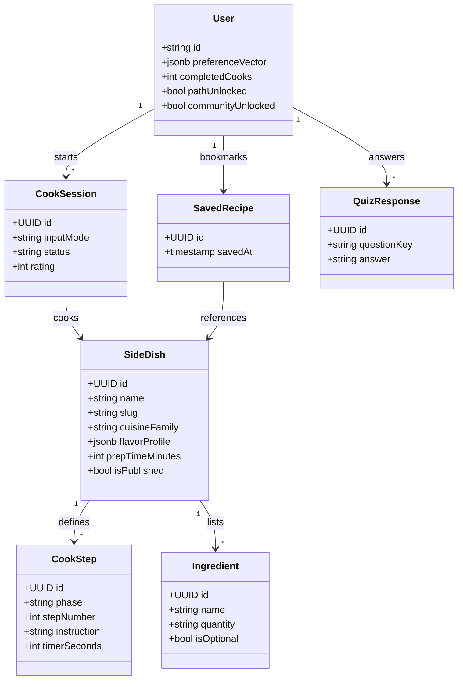

### 19.2 System components (logical view)

How major packages depend on each other at runtime (client vs server boundaries).

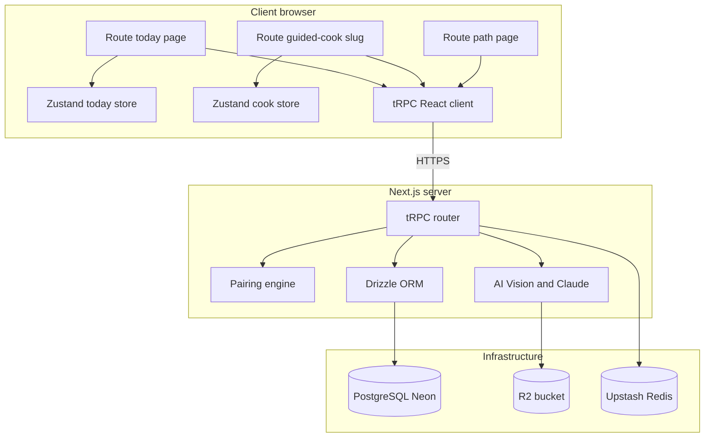

### 19.3 Deployment view (V1)

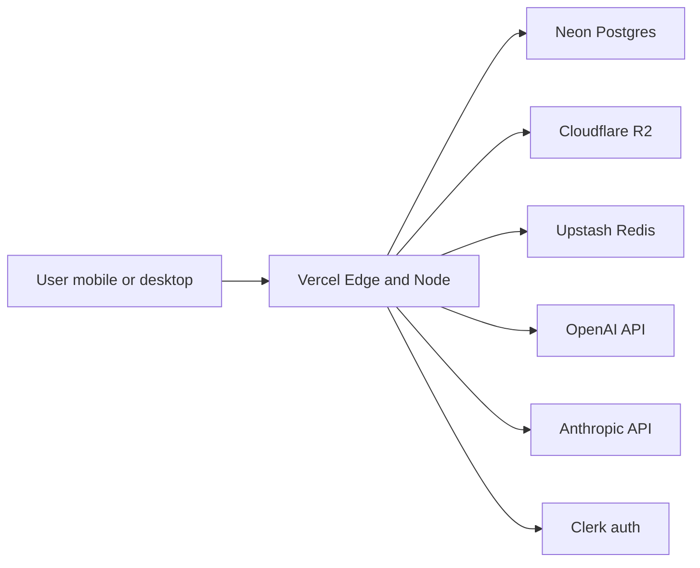

### 19.4 Pairing engine static structure

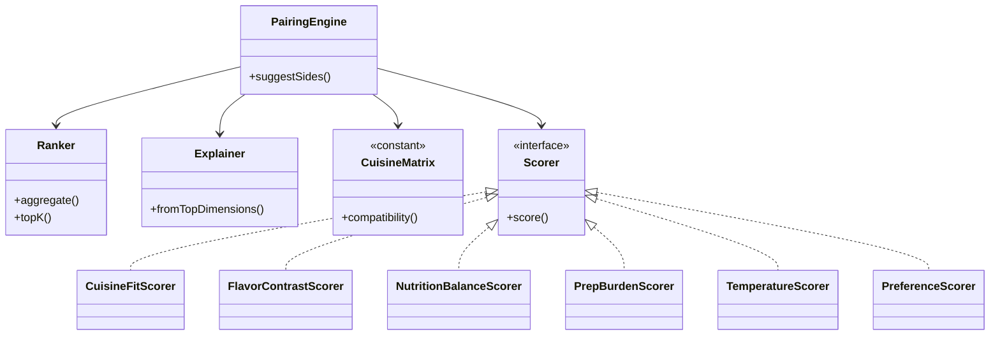

---

## 20. User flows (diagrammatic)

### 20.1 Master journey (V1 scope)

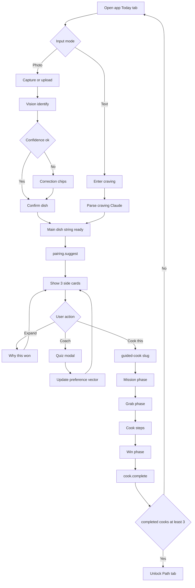

### 20.2 Sequence: text craving to Guided Cook start

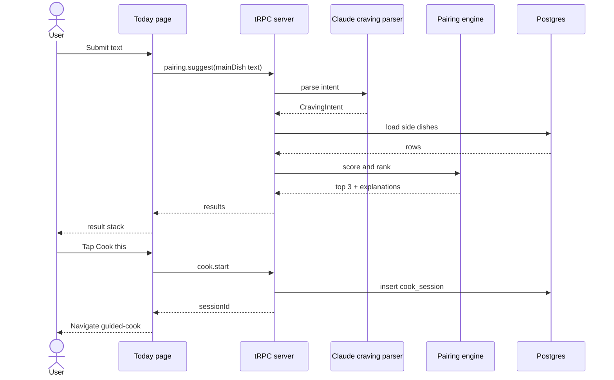

### 20.3 Sequence: photo recognition path

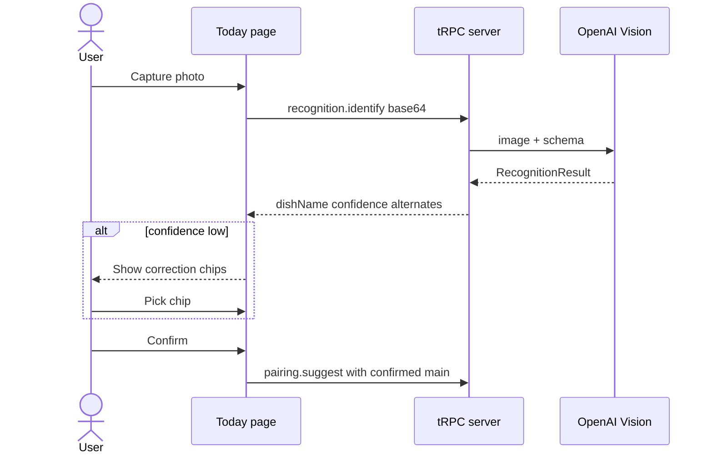

### 20.4 Sequence: complete Guided Cook and unlock Path

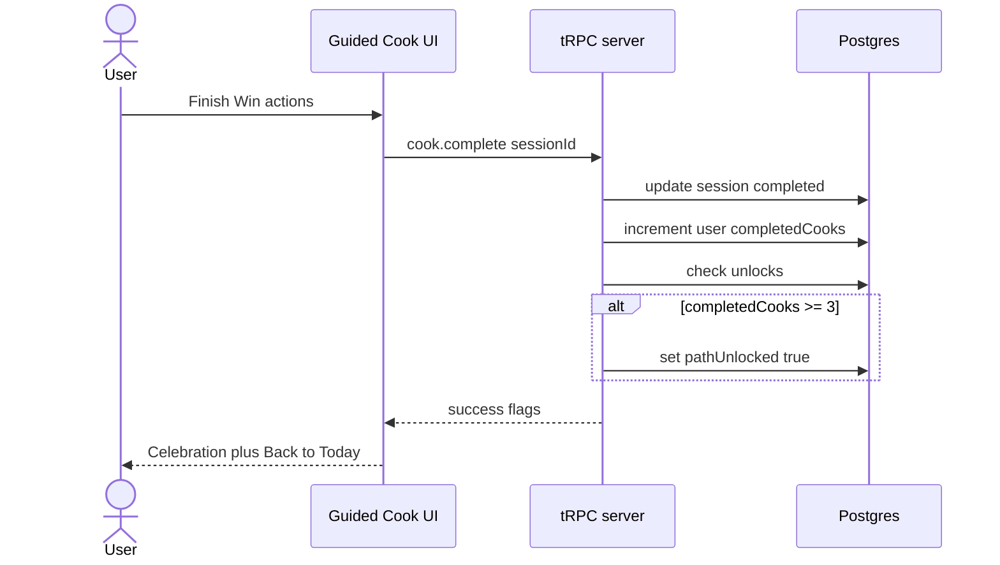

---

## 21. State machines and navigation

### 21.1 Guided Cook phases (orthogonal to step index)

`currentPhase` gates which UI template mounts; within **cook**, `currentStepIndex` walks rows from `cook_steps`.

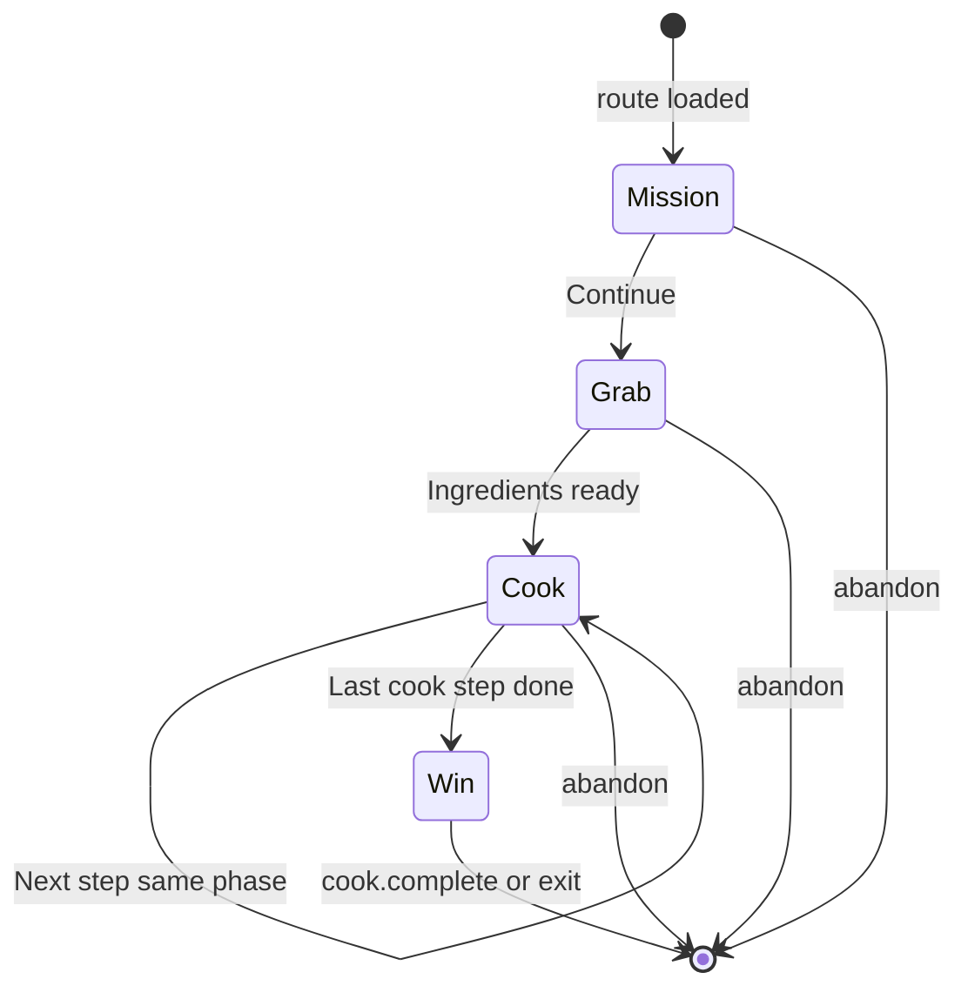

### 21.2 Today page UI states (client)

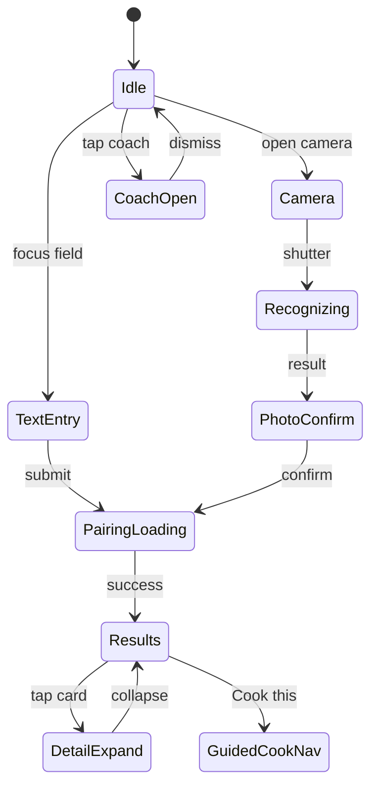

### 21.3 Progressive bottom navigation

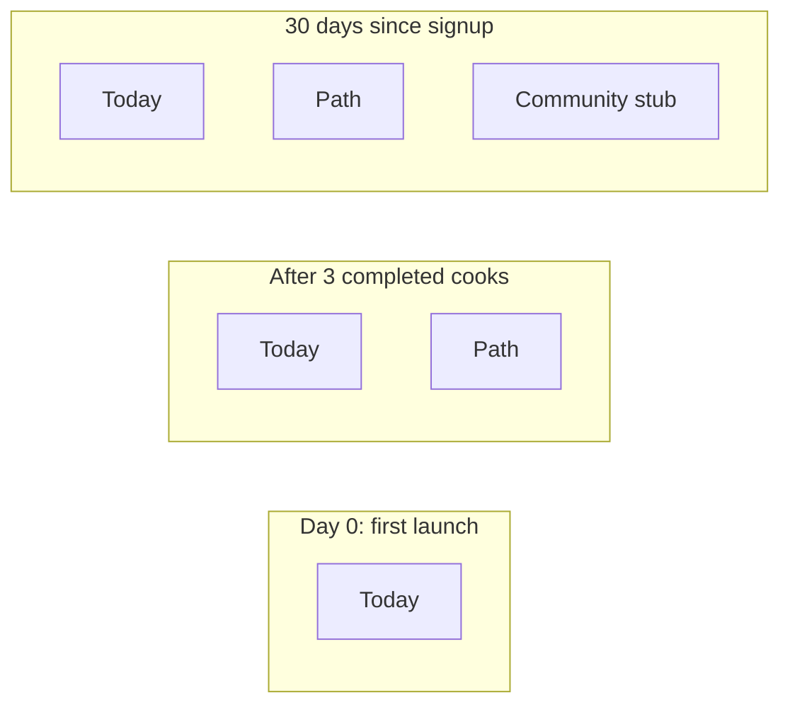

---

## 22. UI wireframes (ASCII)

**Conventions:** `[ ]` = tap target, `...` = scroll, `|` = edge of phone. **Mobile-first**; desktop widens columns and may move coach to a side rail. Typography: strong hierarchy — one H1-equivalent per screen, serif for dish names where brand allows.

### 22.1 Global app shell (all authenticated routes)

```
┌──────────────────────────────┐
│ ≡  Sous            [avatar]  │  ← minimal header; optional streak dot
├──────────────────────────────┤
│                              │
│      (scrollable main)       │
│                              │
│                              │
├──────────────────────────────┤
│  [ Today ]  [ Path* ]  [···]* │  * hidden until unlocked
└──────────────────────────────┘
```

### 22.2 Today — idle / quest card (before input)

```
┌──────────────────────────────┐
│ Good evening, Alex             │
│                                │
│  ┌──────────────────────────┐│
│  │ Tonight's mission        ││
│  │ Pair a side with whatever ││
│  │ you're cooking.          ││
│  │                          ││
│  │   (illustration)         ││
│  └──────────────────────────┘│
│                                │
│  What's on your plate?         │
│  ┌──────────────────────────┐│
│  │ Roast chicken, gyros...  ││  ← text-prompt
│  └──────────────────────────┘│
│  [ 📷 ] or type above          │  ← camera shortcut
│  ... suggestion chips row ...  │
│                                │
│  [ Too tired? ] [ Rescue fridge ]   ← fallback-actions
│                                │
│       (coach avatar pulse)     │  ← opens quiz modal
└──────────────────────────────┘
```

### 22.3 Today — pairing in progress

```
┌──────────────────────────────┐
│ ←                              │
│                                │
│     Finding your sides...      │
│     ████████░░░░  skeleton     │
│     ○ ○ ○  card placeholders   │
│                                │
└──────────────────────────────┘
```

### 22.4 Today — result stack (three suggestions)

```
┌──────────────────────────────┐
│ For: Roast chicken         [i]│
│                                │
│  ┌──────────────────────────┐│
│  │ [img] Tabbouleh         ˅  ││  ← tap expands "why"
│  │ Bright · 15 min prep       ││
│  │ "Adds herb crunch..."      ││
│  │        [ Cook this ]       ││
│  └──────────────────────────┘│
│  ┌──────────────────────────┐│
│  │ [img] Garlic broccoli      ││
│  └──────────────────────────┘│
│  ┌──────────────────────────┐│
│  │ [img] Lemon yogurt sauce ││
│  └──────────────────────────┘│
│                                │
│  [ Reroll sides ]   [ Save set ]│
└──────────────────────────────┘
```

### 22.5 Today — expanded “Why this won” (inline or sheet)

```
┌──────────────────────────────┐
│ Tabbouleh                  ✕  │
│ ────────────────────────────  │
│ Score breakdown (collapsed)  │
│ • Cuisine fit high           │
│ • Fiber and brightness       │
│ • Prep matches your mood     │
│                                │
│ [ Cook this ]  [ Swap later ] │
└──────────────────────────────┘
```

### 22.6 Today — camera capture

```
┌──────────────────────────────┐
│ ✕            Point at food    │
│ ┌──────────────────────────┐ │
│ │                          │ │
│ │    (live camera preview) │ │
│ │            [ target ]    │ │
│ │                          │ │
│ └──────────────────────────┘ │
│        [ ◉ Shutter ]         │
└──────────────────────────────┘
```

### 22.7 Today — photo recognition + correction chips

```
┌──────────────────────────────┐
│ We think this is:             │
│  Margherita pizza   82%       │
│                                │
│ Did we get it wrong?          │
│ [ Margherita ] [ Pepperoni ]  │
│ [ Flatbread ]  [ Other... ]   │
│                                │
│      [ Looks right — Pair ]   │
└──────────────────────────────┘
```

### 22.8 Coach — quiz modal (this-or-that)

```
┌──────────────────────────────┐
│                            ✕  │
│        Coach                  │
│  Tonight, are you feeling—    │
│                                │
│  ┌────────────┐ ┌────────────┐│
│  │  Crunchy   │ │   Saucy    ││
│  └────────────┘ └────────────┘│
│                                │
│  (subtle progress dots)       │
└──────────────────────────────┘
```

### 22.9 Coach — result card (post-quiz)

```
┌──────────────────────────────┐
│                            ✕  │
│   You're garlic naan energy   │
│   tonight.                    │
│   (confetti / illustration)   │
│                                │
│   [ Nice ]                    │
└──────────────────────────────┘
```

### 22.10 Guided Cook — Mission phase

```
┌──────────────────────────────┐
│ ← Exit          Mission ●○○○  │  ← phase-indicator
├──────────────────────────────┤
│  Tabbouleh                    │
│  ─────────                    │
│  Bright herb salad · 15 min   │
│                                │
│  You'll learn: chop herbs     │
│  without bruising, balance    │
│  lemon and oil.               │
│                                │
│  (hero image)                 │
│                                │
│        [ Let's gather ]       │
└──────────────────────────────┘
```

### 22.11 Guided Cook — Grab phase (ingredients)

```
┌──────────────────────────────┐
│ ←            Grab ●●○○       │
├──────────────────────────────┤
│  Gather these                 │
│  ☐ Bulgur      1/2 cup        │
│  ☐ Parsley     2 cups chopped │
│  ☐ Mint        1/2 cup        │
│  ☐ Tomatoes    2 medium       │
│     sub: cherry if needed     │
│  ... scroll ...               │
│                                │
│  [ I have everything ]        │
└──────────────────────────────┘
```

### 22.12 Guided Cook — Cook phase (single step card)

```
┌──────────────────────────────┐
│ ←            Cook ●●●○       │
├──────────────────────────────┤
│ Step 3 of 5                   │
│                                │
│  Soak bulgur in boiling water │
│  10 minutes, then drain.      │
│                                │
│  [ ⏱ Start 10:00 ]            │  ← timer chip
│  [ ⚠ Common mistake ]         │  ← expandable
│  [ 💡 Quick hack ]            │
│                                │
│  (optional step image)        │
│                                │
│  [ Back ]          [ Next ]   │
└──────────────────────────────┘
```

### 22.13 Guided Cook — Win phase

```
┌──────────────────────────────┐
│              Win ●●●●        │
├──────────────────────────────┤
│   You did it.                 │
│   Tabbouleh is ready.         │
│                                │
│   Streak: 4  ·  +1 skill      │
│                                │
│  [ Add photo ]  [ Note ]      │
│  Rating: ☆☆☆☆☆               │
│                                │
│  [ Save to scrapbook ]        │
│                                │
│  [ Cook again ] [ Back Today ] │
└──────────────────────────────┘
```

### 22.14 Path — main tab (unlocked stub layout)

```
┌──────────────────────────────┐
│ Path                          │
│ Level 2 cook · 12 sides tried │
│                                │
│  (skill-map nodes graphic)    │
│      ○──●──○                  │
│     /    \                    │
│    ●      ○                   │
│                                │
│  Recent trend  [ mini chart ] │
│                                │
│  [ Journey → ]                │
│  [ Recipe scrapbook → ]       │
└──────────────────────────────┘
```

### 22.15 Path — Journey subpage

```
┌──────────────────────────────┐
│ ← Journey                     │
│                                │
│  This month                   │
│  ████░░  4 cooks              │
│  Cuisine diversity: 5         │
│                                │
│  ... timeline list ...        │
│  • Tue  Tabouleh + chicken    │
│  • Sun  Dal + rice            │
└──────────────────────────────┘
```

### 22.16 Community — locked / early stub

```
┌──────────────────────────────┐
│ Community                     │
│                                │
│   Unlocks after 30 days       │
│   of cooking with Sous.       │
│                                │
│   (soft illustration)         │
│                                │
│   [ Notify me ]               │
└──────────────────────────────┘
```

### 22.17 Desktop layout notes (breakpoint `lg+`)

- **Today:** two-column grid — left: prompt + coach; right: result stack sticky on scroll.
- **Guided Cook:** narrow centered column (max ~480px) with step card; ingredient list can be a right rail.
- **Path:** skill map wider; scrapbook as masonry grid.

---

## 23. Feature roadmap — post-V1 phases

> Added based on design review and AI architecture analysis. Features are ordered by implementation priority. Each feature lists its **entry point** (where it lives in the UI) and **dependencies** (what must exist first).

---

### 23.1 Evaluate mode (Phase 2A — next priority)

**Entry point:** Bottom sheet triggered from the Results view after selecting sides, AND as a final step on the Win screen after completing a cook.

**What it does:**
- Shows a short appraisal of the user's plate (main + selected sides)
- Confidence-before-compliance: always names two things the plate already does well before suggesting improvements
- One compact plate/balance visualization
- One dominant CTA: `Cook this plate` or `Make one better swap`

**Win screen integration:**
- After completing the Guided Cook Win phase, a `📸 Evaluate my plate` button appears
- User takes a photo of their completed plate
- App provides a confidence-first summary: what worked, one suggestion for next time
- This is a **placeholder camera button** in V1 — full photo analysis comes in Phase 3

**UI rules:**
- Evaluate is a mode transition (bottom sheet), not a separate heavy screen
- Max one appraisal sentence + one action
- Never preachy; uses zero-guilt language
- No nutritional scores or percentages shown — plain-language only

**Component plan:**
```
src/components/today/
  evaluate-sheet.tsx          # Bottom sheet with plate appraisal
  confidence-summary.tsx      # "You already have freshness and fiber..."
  one-degree-chip.tsx         # "Make this one degree healthier" action

src/components/guided-cook/
  evaluate-plate-button.tsx   # Camera placeholder on Win screen
```

**Dependencies:** Results view must exist (already built). Win screen must exist (already built as `/cook/[slug]`).

---

### 23.2 Saved for later + Path scrapbook (Phase 2B)

**Entry point:** Heart button on quest cards saves dishes to the user's scrapbook, accessible from the Path tab.

**What it does:**
- Tapping ♡ on any quest card saves that dish to `saved_recipes` in the database
- Path tab includes a "Scrapbook" section showing all saved dishes
- Saved dishes can be cooked directly from the scrapbook
- Scrapbook also shows completed cook photos and personal notes

**Data model:**
- `saved_recipes` table already exists in the schema (§3)
- Add a `savedFromSource` field: `quest` | `results` | `manual`
- Scrapbook entries combine `saved_recipes` + `cook_sessions` with photos

**Component plan:**
```
src/components/path/
  recipe-scrapbook.tsx        # Grid of saved + completed dishes
  scrapbook-card.tsx          # Individual dish card with photo/note
  saved-dishes-strip.tsx      # Horizontal strip preview on Path main
```

**Dependencies:** Path tab layout (stubbed). `saved_recipes` DB table (schema exists, needs queries).

---

### 23.3 Save plate patterns (Phase 3 — later)

**What it does:**
Instead of only saving individual recipes, users can save reusable **plate patterns** — abstract meal structures that can be re-applied:

- `rich main + cooling side + crunchy veg`
- `rice main + protein side + fresh acid side`
- `comfort main + bright salad + warm bread`

**Why this matters:**
- Patterns are more transferable than individual recipes
- The pairing engine can use saved patterns to bias future recommendations
- Users build a personal vocabulary of meal structures over time

**Data model addition:**
```typescript
export const platePatterns = pgTable('plate_patterns', {
  id: uuid('id').primaryKey().defaultRandom(),
  userId: text('user_id').references(() => users.id).notNull(),
  name: text('name').notNull(),           // user-given or auto-generated
  structure: jsonb('structure').$type<{
    mainCategory: string;                  // "rich", "light", "rice-based"
    sideSlots: Array<{
      role: string;                        // "cooling", "crunchy", "acid"
      flavorProfile: string[];
    }>;
  }>().notNull(),
  usageCount: integer('usage_count').default(0),
  createdAt: timestamp('created_at').defaultNow(),
});
```

**Dependencies:** Evaluate mode (23.1). User needs to have completed enough cooks for patterns to emerge.

---

### 23.4 One-degree healthier (Phase 3 — later, Gemma integration)

**Entry point:** Inside Evaluate mode as a secondary action.

**What it does:**
- After evaluating a plate, user can tap `Make this one degree healthier`
- System proposes exactly **one** small change — never a full meal replacement
- Preserves cultural recognizability of the original meal
- Examples:
  - "You already have freshness and contrast. Add one protein anchor."
  - "This is close. Swap the fries for roasted sweet potatoes."
  - "Keep the meal. Just add a side of cucumber raita."

**Rules:**
- Never suggest total meal replacement
- Prefer one small side change over multiple
- Optionally offer one garnish or technique tweak
- Always preserve the identity of the meal

**Dependencies:** Evaluate mode (23.1). Gemma or Claude integration for contextual suggestions.

---

### 23.5 Make this taste better (Phase 3 — later, Gemma)

**Entry point:** Inside Guided Cook as a contextual chip, or inside Evaluate as a secondary action.

**What it does:**
- Suggests one **culinary improvement**, not a health lecture
- Examples:
  - "Caramelize the onions 5 more minutes for deeper flavor"
  - "Finish with a squeeze of lemon — acid wakes everything up"
  - "Add cooling crunch: quick-pickled radish on top"
  - "Reduce the sauce a bit further for gloss"

**Why this matters:**
Makes Sous feel like a cooking-fluency product, not just a health product. This is the core differentiator.

**Dependencies:** Guided Cook flow (exists). Gemma/Claude contextual integration.

---

### 23.6 Guided Cook recovery flow (Phase 3 — later)

**Entry point:** `Something went wrong` button inside Cook phase steps.

**What it does:**
- User taps the button when something goes wrong mid-cook
- Chooses from failure-state shortcuts or types the problem:
  - too watery / too dry / bland / over-browned / running late
- App proposes one minimal rescue action
- Cook resumes without leaving the flow

**Component plan:**
```
src/components/guided-cook/
  recovery-sheet.tsx          # Bottom sheet with failure shortcuts
  rescue-action.tsx           # Single rescue suggestion card
```

**Dependencies:** Guided Cook flow (exists). Gemma/Claude for contextual rescue suggestions.

---

### 23.7 Bounded recommendation agent (Phase 4 — later, Gemma)

**Entry point:** One `For you tonight` card on Today tab, replacing or augmenting the quest card rotation.

**What it does:**
1. Daily scheduler reads local memory (saved meals, completed cooks, repeated cuisines, skipped dishes)
2. Deterministic ranking filters candidates from the dish database
3. Gemma writes concise recommendation cards
4. User sees **one** featured recommendation — never an infinite feed

**UI rule:**
Recommendations appear as either:
- One `For you tonight` card (replaces quest card when available)
- One dismissible below-the-fold section

Never as an infinite feed on Today.

**Dependencies:** User history data (cook sessions). Gemma integration. Pattern saving (23.3) for better personalization.

---

### 23.8 UI clutter control rules (standing policy)

These rules apply to ALL future feature additions:

1. One primary CTA per screen
2. No more than one hero card above the fold
3. Max 3 secondary chips visible at once
4. Path metrics capped to 3 blocks
5. Today never becomes a dashboard
6. Social proof only below the fold in prototype
7. Recommendation surfaces capped to one featured card
8. Any new feature must prove it helps the user cook tonight or belong elsewhere

**Escalation rule for new features:**
1. Hidden logic (no UI)
2. Optional chip
3. Secondary sheet
4. Primary surface only if repeatedly high value

---

### 23.9 Revised component map (target state)

```
src/components/
  today/
    quest-card.tsx                 # Swipeable card stack (built)
    craving-trigger.tsx            # Bird mascot + speech bubble (built as bird-mascot.tsx)
    streak-chip.tsx                # Tiny inline streak counter (built as streak-counter.tsx)
    search-popout.tsx              # Bottom sheet craving input (built)
    text-prompt.tsx                # Text input field (built)
    result-stack.tsx               # 3 side dish results (built)
    fallback-actions.tsx           # Rescue fridge, play game, order out (built)
    friends-strip.tsx              # Social proof strip (built)
    camera-input.tsx               # Camera capture (built)
    correction-chips.tsx           # Photo correction chips (built)
    evaluate-sheet.tsx             # Plate evaluation bottom sheet (Phase 2A)
    confidence-summary.tsx         # Confidence-first appraisal (Phase 2A)
    one-degree-chip.tsx            # One-degree-healthier action (Phase 3)
    featured-recommendation.tsx    # AI recommendation card (Phase 4)

  guided-cook/
    step-card.tsx                  # Cook step (built)
    phase-indicator.tsx            # Mission/Grab/Cook/Win (built)
    timer.tsx                      # Countdown timer (built)
    mistake-chip.tsx               # Warning expandable (built)
    hack-chip.tsx                  # Quick hack expandable (built)
    evaluate-plate-button.tsx      # Camera placeholder on Win (Phase 2A)
    recovery-sheet.tsx             # Something went wrong (Phase 3)

  path/
    recipe-scrapbook.tsx           # Saved + completed dishes (Phase 2B)
    scrapbook-card.tsx             # Individual dish card (Phase 2B)
    journey-nodes.tsx              # 2-3 node skill journey (Phase 2B)
    weekly-goal-card.tsx           # Weekly cooking goal (Phase 2B)
    next-unlock-card.tsx           # Next milestone preview (Phase 2B)

  shared/
    device-frame.tsx               # Phone frame dev container (built)
    user-avatar.tsx                # User avatar (built)
    tab-bar.tsx                    # Bottom navigation (built)
```